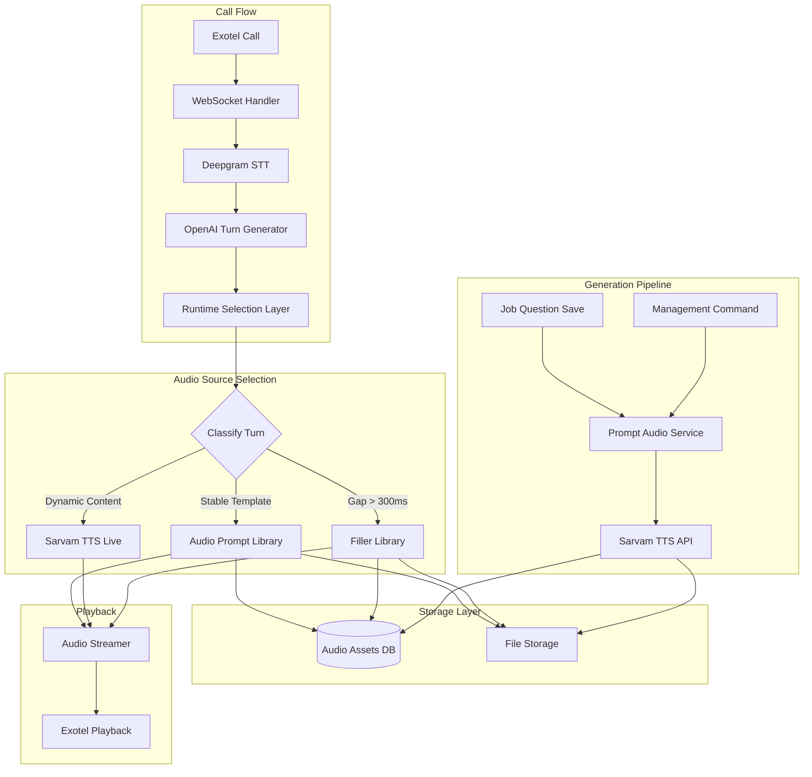
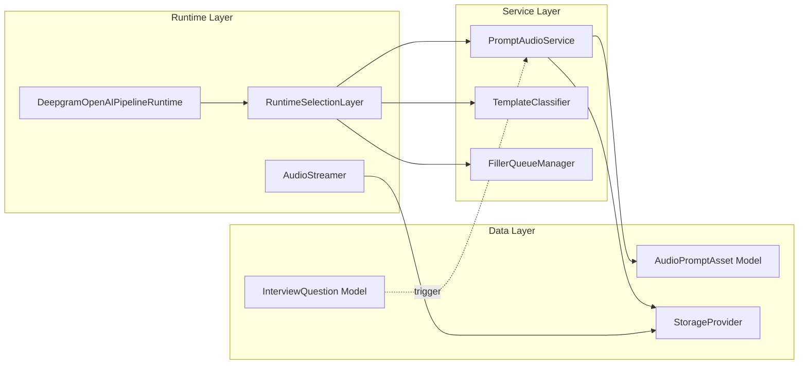
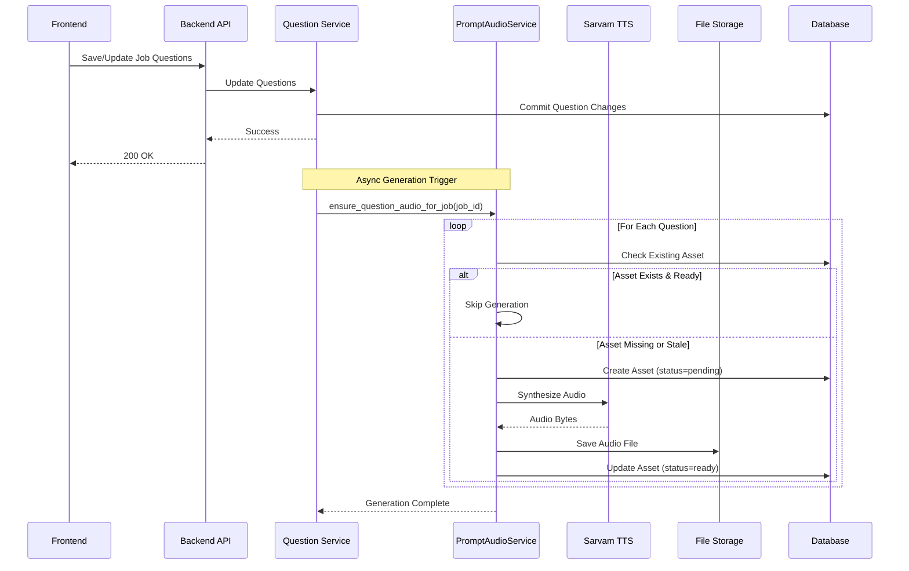
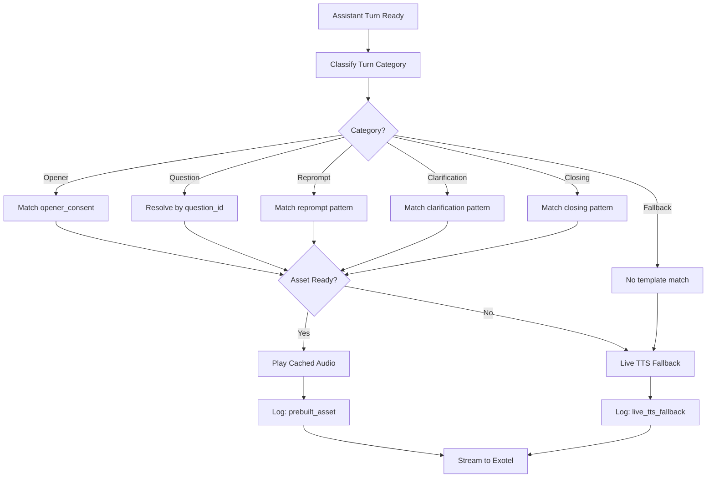
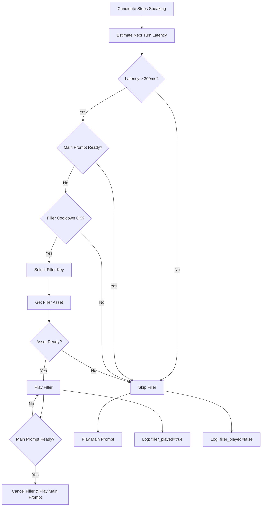
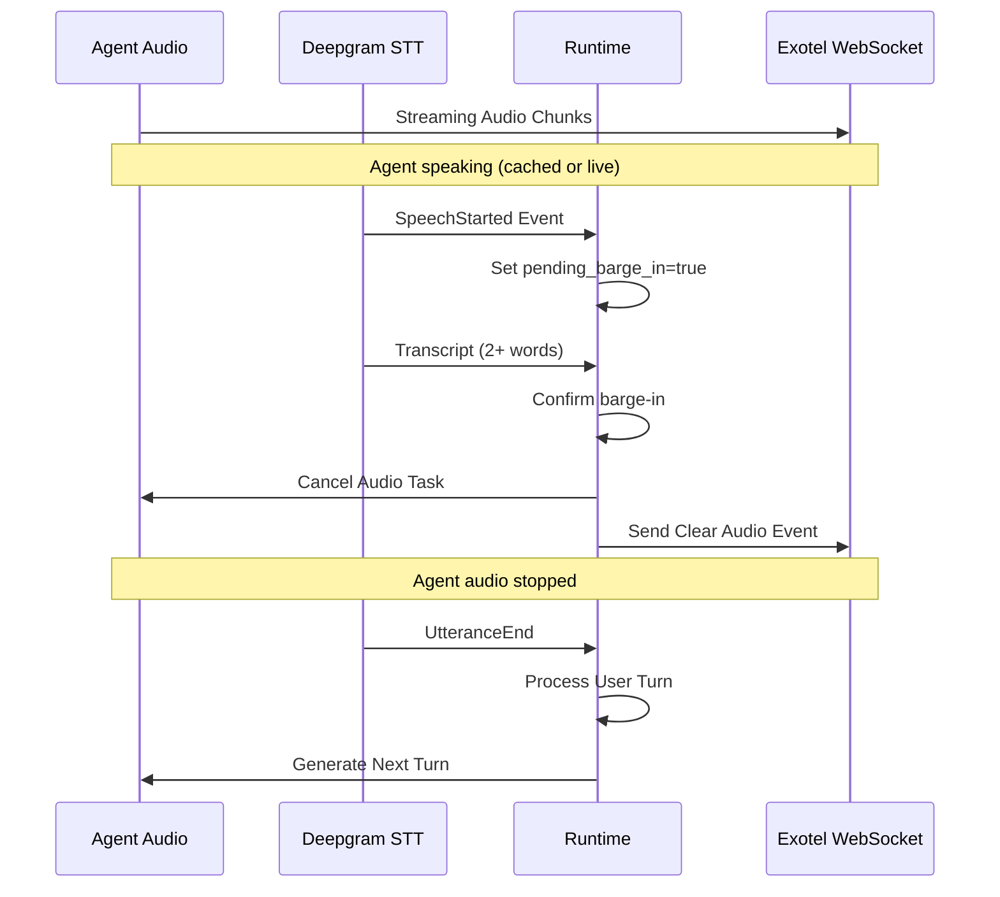
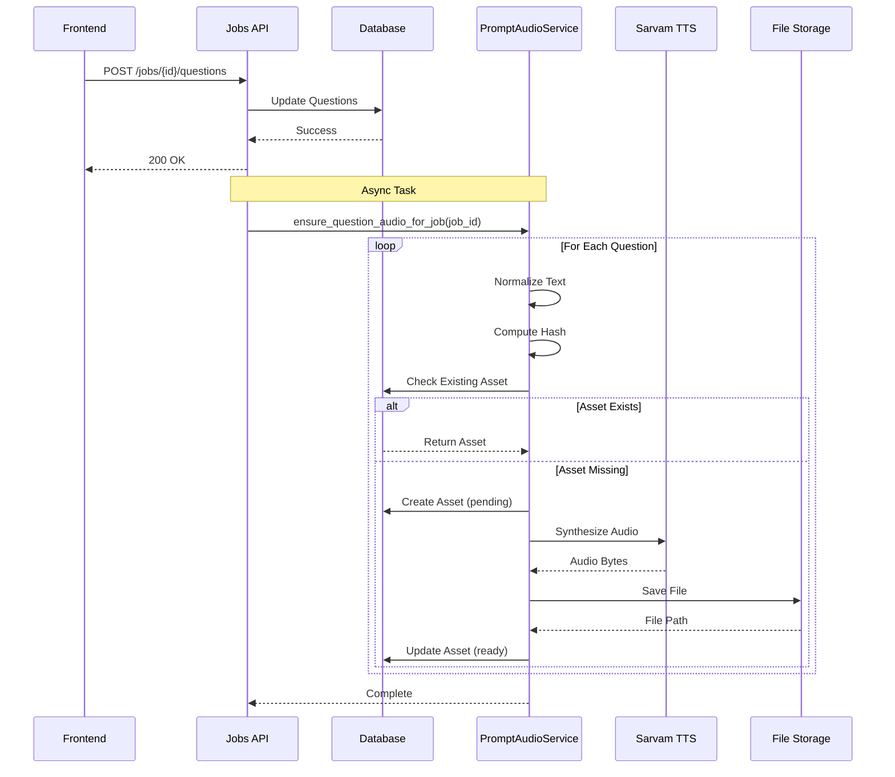
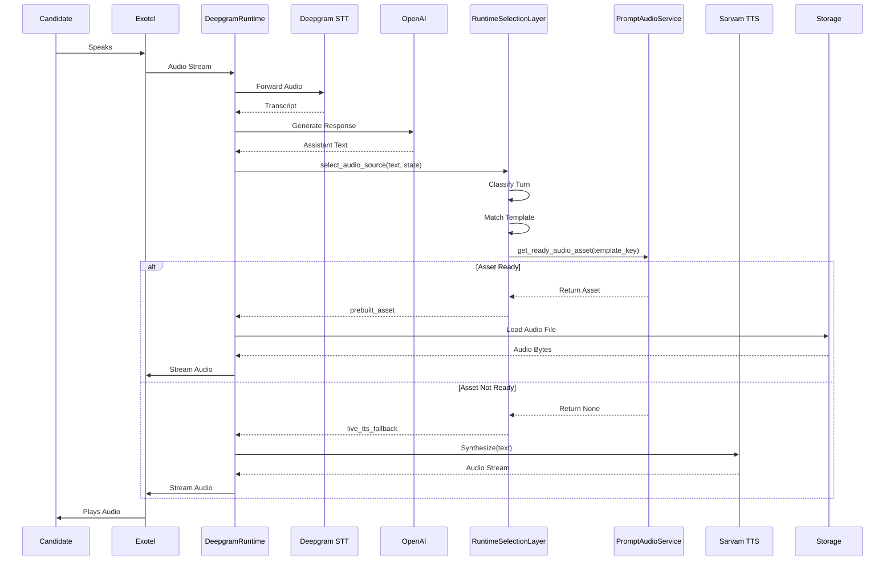

# Design Document: Pre-Generated TTS and Filler Audio System

## Overview

This document defines the technical design for implementing a hybrid audio system that pre-generates stable recruiter prompts while maintaining dynamic TTS fallback. The system addresses the primary latency issue in RecruiteAI's voice interview platform: noticeable gaps before agent speech caused by live Sarvam TTS synthesis for every turn.

### Problem Statement

The current architecture synthesizes every recruiter prompt live via Sarvam TTS, creating latency gaps of 500ms-2000ms during calls. While previous optimizations (streaming playback, jitter buffering, prompt compression) have helped, they cannot eliminate the fundamental cost of live synthesis.

### Solution Approach

Implement a hybrid architecture that:
1. **Pre-generates audio** for stable, high-frequency prompts (consent opener, interview questions, reprompts, clarifications, closers)
2. **Uses optional short fillers** (e.g., "understood", "got it") to mask compute gaps exceeding 300ms
3. **Preserves live Sarvam TTS** as a fallback for truly dynamic turns
4. **Routes runtime behavior** through a classification layer that selects cached audio when available

### Key Benefits

- **Reduced latency**: Pre-generated audio plays instantly (no synthesis delay)
- **Improved consistency**: Stable wording for common prompts
- **Cost reduction**: Fewer live TTS API calls for repeated prompts
- **Better UX**: Faster first impression, smoother turn transitions
- **Maintained flexibility**: Dynamic fallback for novel responses

### Design Principles

1. **Hybrid over pure scripting**: Keep dynamic TTS for flexibility
2. **Deterministic routing**: Use template matching, not ML classification
3. **Graceful degradation**: Always fall back to live TTS on errors
4. **Observability first**: Log every routing decision for debugging
5. **Incremental rollout**: Phase implementation to validate benefits


## Architecture

### High-Level System Architecture



### Component Architecture



### Integration with Existing Architecture

The system integrates with the existing RecruiteAI voice pipeline:

**Existing Flow:**
```
Exotel → WebSocket → Deepgram STT → OpenAI → Sarvam TTS → Exotel Playback
```

**Enhanced Flow:**
```
Exotel → WebSocket → Deepgram STT → OpenAI → [NEW: Runtime Selection Layer] → Cached Audio OR Sarvam TTS → Exotel Playback
```

**Key Integration Points:**

1. **DeepgramOpenAIPipelineRuntime** (`backend/app/services/deepgram_runtime.py`)
   - Insert RuntimeSelectionLayer before `_speak_text()`
   - Add cached audio playback path alongside live TTS
   - Preserve existing barge-in and interruption logic

2. **InterviewQuestion Model** (`backend/app/models/question.py`)
   - Add trigger on question save/update to generate audio
   - No schema changes required (audio metadata stored separately)

3. **StorageProvider** (`backend/app/services/storage.py`)
   - Use existing abstraction for audio file storage
   - Path pattern: `prompt-audio/{category}/{version}/{hash}.pcm`

4. **Observability Service** (`backend/app/services/observability.py`)
   - Extend to log audio source routing decisions
   - Track latency metrics for cached vs live audio


## Components and Interfaces

### 1. Audio Prompt Library (Data Layer)

#### AudioPromptAsset Model

**Purpose:** Store metadata for all pre-generated audio assets.

**Schema:**

```python
class AudioPromptAsset(Base):
    __tablename__ = "audio_prompt_assets"
    
    # Primary identification
    id: UUID = primary_key
    template_key: str = index  # e.g., "opener_consent", "question_12345"
    category: str  # opener, question, reprompt, clarification, closing, filler
    
    # Content
    text: str  # normalized prompt text
    file_path: str  # relative path in storage
    file_hash: str = index  # SHA-256 of (normalized_text + config)
    duration_ms: int  # audio duration for scheduling
    
    # Synthesis configuration
    provider: str = default("sarvam")
    speaker: str = default("priya")
    language_code: str = default("en-IN")
    sample_rate: int = default(8000)
    codec: str = default("linear16")
    pace: float = default(1.2)
    
    # Job/question association (nullable for global templates)
    job_id: UUID = nullable, foreign_key("jobs.id")
    question_id: UUID = nullable, foreign_key("interview_questions.id")
    
    # Lifecycle
    version: int = default(1)
    status: str  # pending, ready, failed
    last_generated_at: datetime = nullable
    created_at: datetime
    updated_at: datetime
    
    # Indexes
    __table_args__ = (
        Index('idx_template_key_version', 'template_key', 'version', unique=True),
        Index('idx_job_question', 'job_id', 'question_id'),
        Index('idx_file_hash', 'file_hash'),
        Index('idx_status', 'status'),
    )
```

**Key Design Decisions:**

- **Composite unique constraint (template_key, version)**: Allows multiple versions of the same template while preventing duplicate version numbers
- **file_hash for deduplication**: Identical prompts share audio files
- **nullable job_id/question_id**: Supports both global and job-specific assets
- **status field**: Enables async generation tracking
- **version field**: Supports prompt text updates without breaking existing calls


#### Optional: JobPromptGenerationRun Model

**Purpose:** Track bulk generation progress for observability.

**Schema:**

```python
class JobPromptGenerationRun(Base):
    __tablename__ = "job_prompt_generation_runs"
    
    id: UUID = primary_key
    job_id: UUID = foreign_key("jobs.id")
    status: str  # pending, in_progress, completed, failed
    started_at: datetime
    completed_at: datetime = nullable
    success_count: int = default(0)
    failure_count: int = default(0)
    error_summary: JSON = nullable
    created_at: datetime
```

**Usage:** Optional for Phase 1, useful for monitoring when generation moves to background workers.


### 2. PromptAudioService (Service Layer)

**Purpose:** Generate, persist, and retrieve audio assets.

**Interface:**

```python
class PromptAudioService:
    """Service for managing pre-generated audio assets."""
    
    def __init__(
        self,
        session_factory: Callable,
        storage_provider: StorageProvider,
        tts_provider: TTSProvider
    ):
        self.session_factory = session_factory
        self.storage = storage_provider
        self.tts = tts_provider
    
    async def ensure_prompt_audio(
        self,
        *,
        template_key: str,
        category: str,
        text: str,
        job_id: UUID | None = None,
        question_id: UUID | None = None,
        force_regenerate: bool = False
    ) -> AudioPromptAsset:
        """
        Ensure audio asset exists for the given prompt.
        Returns existing ready asset or generates new one.
        """
        
    async def ensure_question_audio_for_job(
        self,
        *,
        job_id: UUID
    ) -> list[AudioPromptAsset]:
        """
        Generate audio for all questions in a job.
        Returns list of assets (ready or pending).
        """
        
    async def ensure_default_fillers(self) -> list[AudioPromptAsset]:
        """
        Generate default filler library.
        Returns list of filler assets.
        """
        
    async def get_ready_audio_asset(
        self,
        *,
        template_key: str | None = None,
        job_id: UUID | None = None,
        question_id: UUID | None = None
    ) -> AudioPromptAsset | None:
        """
        Retrieve a ready audio asset by lookup criteria.
        Returns None if not found or not ready.
        """
        
    async def _normalize_text(self, text: str) -> str:
        """Normalize prompt text for consistent hashing."""
        
    async def _compute_asset_hash(
        self,
        normalized_text: str,
        speaker: str,
        language_code: str,
        pace: float,
        provider: str
    ) -> str:
        """Compute deterministic hash for asset deduplication."""
        
    async def _synthesize_and_persist(
        self,
        asset: AudioPromptAsset
    ) -> None:
        """Synthesize audio via TTS and persist to storage."""
```

**Key Algorithms:**

1. **Text Normalization:**
   ```python
   def _normalize_text(self, text: str) -> str:
       # Remove extra whitespace
       text = " ".join(text.split())
       # Convert to lowercase for case-insensitive matching
       text = text.lower()
       # Remove punctuation variations (optional)
       text = text.strip(".,!?")
       return text
   ```

2. **Asset Hash Computation:**
   ```python
   def _compute_asset_hash(
       self,
       normalized_text: str,
       speaker: str,
       language_code: str,
       pace: float,
       provider: str
   ) -> str:
       import hashlib
       
       # Combine all synthesis parameters
       hash_input = f"{normalized_text}|{speaker}|{language_code}|{pace}|{provider}"
       
       # Use SHA-256 for deterministic hashing
       return hashlib.sha256(hash_input.encode('utf-8')).hexdigest()
   ```

3. **Ensure Logic:**
   ```python
   async def ensure_prompt_audio(self, ...) -> AudioPromptAsset:
       normalized_text = await self._normalize_text(text)
       asset_hash = await self._compute_asset_hash(
           normalized_text, speaker, language_code, pace, provider
       )
       
       # Check for existing ready asset
       if not force_regenerate:
           existing = await self._find_by_hash(asset_hash, status="ready")
           if existing:
               return existing
       
       # Create or update asset record
       asset = await self._create_or_update_asset(
           template_key=template_key,
           category=category,
           text=text,
           file_hash=asset_hash,
           job_id=job_id,
           question_id=question_id,
           status="pending"
       )
       
       # Synthesize and persist
       try:
           await self._synthesize_and_persist(asset)
           asset.status = "ready"
           asset.last_generated_at = datetime.utcnow()
       except Exception as e:
           asset.status = "failed"
           logger.error(f"Audio generation failed for {template_key}: {e}")
       
       await self._save(asset)
       return asset
   ```


### 3. RuntimeSelectionLayer (Service Layer)

**Purpose:** Classify assistant turns and route to appropriate audio source.

**Interface:**

```python
class RuntimeSelectionLayer:
    """Routes assistant turns to cached audio or live TTS."""
    
    def __init__(
        self,
        prompt_audio_service: PromptAudioService,
        filler_queue_manager: FillerQueueManager
    ):
        self.prompt_audio = prompt_audio_service
        self.filler_queue = filler_queue_manager
    
    async def select_audio_source(
        self,
        *,
        assistant_text: str,
        conversation_state: ConversationState,
        job_id: UUID,
        current_question_id: UUID | None = None
    ) -> AudioSourceSelection:
        """
        Classify turn and select audio source.
        Returns selection with source type and asset/text.
        """
        
    async def should_play_filler(
        self,
        *,
        estimated_latency_ms: int,
        last_filler_played_at: datetime | None
    ) -> tuple[bool, str | None]:
        """
        Determine if filler should play based on latency threshold.
        Returns (should_play, filler_key).
        """
        
    def _classify_turn(
        self,
        assistant_text: str,
        conversation_state: ConversationState
    ) -> PromptCategory:
        """Classify assistant turn into prompt category."""
        
    def _match_template(
        self,
        assistant_text: str,
        category: PromptCategory
    ) -> str | None:
        """Match text to known template key."""


@dataclass
class AudioSourceSelection:
    """Result of audio source selection."""
    source_type: str  # prebuilt_asset, filler_asset, live_tts, live_tts_fallback
    template_key: str | None
    asset: AudioPromptAsset | None
    fallback_text: str | None
    filler_key: str | None
```

**Classification Algorithm:**

```python
def _classify_turn(
    self,
    assistant_text: str,
    conversation_state: ConversationState
) -> PromptCategory:
    """
    Deterministic classification based on conversation state and text patterns.
    """
    
    # Priority 1: Consent opener
    if not conversation_state.consent_granted and not conversation_state.consent_prompt_delivered:
        return PromptCategory.OPENER
    
    # Priority 2: Closing
    if conversation_state.termination_requested or self._is_closing_phrase(assistant_text):
        return PromptCategory.CLOSING
    
    # Priority 3: Off-topic redirect
    if conversation_state.off_topic_count > 0 and self._is_redirect_phrase(assistant_text):
        return PromptCategory.OFF_TOPIC_REDIRECT
    
    # Priority 4: Reprompt
    if self._is_reprompt_phrase(assistant_text):
        return PromptCategory.REPROMPT
    
    # Priority 5: Clarification
    if self._is_clarification_phrase(assistant_text):
        return PromptCategory.CLARIFICATION
    
    # Priority 6: Question (if current question is set)
    if conversation_state.current_question_id:
        return PromptCategory.QUESTION
    
    # Default: Dynamic fallback
    return PromptCategory.FALLBACK_DYNAMIC


def _match_template(
    self,
    assistant_text: str,
    category: PromptCategory
) -> str | None:
    """
    Match text to known template using deterministic patterns.
    """
    
    # Normalize for matching
    normalized = self._normalize_for_matching(assistant_text)
    
    # Category-specific template matching
    if category == PromptCategory.OPENER:
        return "opener_consent"
    
    elif category == PromptCategory.REPROMPT:
        reprompt_patterns = {
            "can you tell me more": "reprompt_elaborate",
            "can you elaborate": "reprompt_elaborate",
            "can you give me an example": "reprompt_example",
            "could you clarify": "reprompt_clarify",
        }
        for pattern, template_key in reprompt_patterns.items():
            if pattern in normalized:
                return template_key
    
    elif category == PromptCategory.CLARIFICATION:
        clarification_patterns = {
            "could you repeat": "clarification_repeat",
            "can you say that again": "clarification_repeat",
            "tell me more about": "clarification_more",
        }
        for pattern, template_key in clarification_patterns.items():
            if pattern in normalized:
                return template_key
    
    elif category == PromptCategory.CLOSING:
        closing_patterns = {
            "thank you for your time": "closing_thank_you",
            "we'll be in touch": "closing_next_steps",
        }
        for pattern, template_key in closing_patterns.items():
            if pattern in normalized:
                return template_key
    
    elif category == PromptCategory.QUESTION:
        # Question templates are resolved by question_id, not text matching
        return None
    
    return None
```

**Selection Algorithm:**

```python
async def select_audio_source(
    self,
    *,
    assistant_text: str,
    conversation_state: ConversationState,
    job_id: UUID,
    current_question_id: UUID | None = None
) -> AudioSourceSelection:
    """
    Main selection logic with fallback chain.
    """
    
    # Step 1: Classify turn
    category = self._classify_turn(assistant_text, conversation_state)
    
    # Step 2: Try template matching
    template_key = self._match_template(assistant_text, category)
    
    # Step 3: For questions, use question_id directly
    if category == PromptCategory.QUESTION and current_question_id:
        template_key = f"question_{current_question_id}"
    
    # Step 4: Lookup asset if template matched
    asset = None
    if template_key:
        asset = await self.prompt_audio.get_ready_audio_asset(
            template_key=template_key,
            job_id=job_id if category == PromptCategory.QUESTION else None,
            question_id=current_question_id if category == PromptCategory.QUESTION else None
        )
    
    # Step 5: Determine source type
    if asset and asset.status == "ready":
        return AudioSourceSelection(
            source_type="prebuilt_asset",
            template_key=template_key,
            asset=asset,
            fallback_text=None,
            filler_key=None
        )
    else:
        # Fallback to live TTS
        return AudioSourceSelection(
            source_type="live_tts_fallback" if template_key else "live_tts",
            template_key=template_key,
            asset=None,
            fallback_text=assistant_text,
            filler_key=None
        )
```


### 4. FillerQueueManager (Service Layer)

**Purpose:** Manage filler audio queueing logic and threshold rules.

**Interface:**

```python
class FillerQueueManager:
    """Manages filler audio selection and queueing rules."""
    
    FILLER_THRESHOLD_MS = 300  # Only play filler if gap exceeds this
    FILLER_COOLDOWN_MS = 5000  # Minimum time between fillers
    
    def __init__(self, prompt_audio_service: PromptAudioService):
        self.prompt_audio = prompt_audio_service
        self._filler_keys = [
            "filler_understood",
            "filler_got_it",
            "filler_okay",
            "filler_thanks",
            "filler_sure",
            "filler_one_moment"
        ]
    
    async def should_play_filler(
        self,
        *,
        estimated_latency_ms: int,
        last_filler_played_at: datetime | None,
        main_prompt_ready: bool
    ) -> tuple[bool, str | None]:
        """
        Determine if filler should play.
        Returns (should_play, filler_key).
        """
        
    async def get_filler_asset(self, filler_key: str) -> AudioPromptAsset | None:
        """Retrieve ready filler asset."""
        
    def _select_filler_key(self, last_filler_key: str | None) -> str:
        """Select next filler key (round-robin to avoid repetition)."""
```

**Filler Selection Algorithm:**

```python
async def should_play_filler(
    self,
    *,
    estimated_latency_ms: int,
    last_filler_played_at: datetime | None,
    main_prompt_ready: bool
) -> tuple[bool, str | None]:
    """
    Filler queueing rules:
    1. Skip if main prompt already ready
    2. Skip if estimated latency < threshold
    3. Skip if filler played recently (cooldown)
    4. Otherwise, select and play filler
    """
    
    # Rule 1: Skip if main prompt ready
    if main_prompt_ready:
        return (False, None)
    
    # Rule 2: Skip if latency below threshold
    if estimated_latency_ms < self.FILLER_THRESHOLD_MS:
        return (False, None)
    
    # Rule 3: Check cooldown
    if last_filler_played_at:
        time_since_last = (datetime.utcnow() - last_filler_played_at).total_seconds() * 1000
        if time_since_last < self.FILLER_COOLDOWN_MS:
            return (False, None)
    
    # Rule 4: Select filler
    filler_key = self._select_filler_key(last_filler_key=None)  # TODO: track last key
    return (True, filler_key)


def _select_filler_key(self, last_filler_key: str | None) -> str:
    """
    Round-robin selection to avoid repetition.
    """
    if not last_filler_key:
        return self._filler_keys[0]
    
    try:
        last_index = self._filler_keys.index(last_filler_key)
        next_index = (last_index + 1) % len(self._filler_keys)
        return self._filler_keys[next_index]
    except ValueError:
        return self._filler_keys[0]
```


### 5. DeepgramRuntime Integration (Runtime Layer)

**Purpose:** Integrate cached audio playback into existing runtime.

**Modified Flow:**

```python
class DeepgramOpenAIPipelineRuntime(RealtimeBridge):
    """Enhanced runtime with cached audio support."""
    
    def __init__(self):
        super().__init__()
        # ... existing initialization ...
        self.runtime_selection = RuntimeSelectionLayer(
            prompt_audio_service=PromptAudioService(...),
            filler_queue_manager=FillerQueueManager(...)
        )
        self._last_filler_played_at: datetime | None = None
        self._last_filler_key: str | None = None
    
    async def _handle_assistant_turn(
        self,
        *,
        websocket: WebSocket,
        provider: str,
        stream_id: str,
        assistant_text: str,
        call_id: UUID,
        conversation_state: ConversationState,
        job_id: UUID,
        current_question_id: UUID | None
    ) -> None:
        """
        Enhanced turn handler with audio source selection.
        """
        
        # Step 1: Select audio source
        selection = await self.runtime_selection.select_audio_source(
            assistant_text=assistant_text,
            conversation_state=conversation_state,
            job_id=job_id,
            current_question_id=current_question_id
        )
        
        # Step 2: Check if filler needed
        estimated_latency_ms = 0  # TODO: estimate based on source type
        if selection.source_type == "live_tts":
            estimated_latency_ms = 800  # Typical Sarvam latency
        
        should_play_filler, filler_key = await self.runtime_selection.filler_queue.should_play_filler(
            estimated_latency_ms=estimated_latency_ms,
            last_filler_played_at=self._last_filler_played_at,
            main_prompt_ready=(selection.source_type == "prebuilt_asset")
        )
        
        # Step 3: Play filler if needed
        if should_play_filler and filler_key:
            filler_asset = await self.runtime_selection.filler_queue.get_filler_asset(filler_key)
            if filler_asset:
                await self._play_cached_audio(
                    websocket=websocket,
                    provider=provider,
                    stream_id=stream_id,
                    asset=filler_asset,
                    call_id=call_id
                )
                self._last_filler_played_at = datetime.utcnow()
                self._last_filler_key = filler_key
                
                # Log filler usage
                logger.info(
                    "Filler played",
                    extra={
                        "call_id": str(call_id),
                        "filler_key": filler_key,
                        "estimated_latency_ms": estimated_latency_ms
                    }
                )
        
        # Step 4: Play main prompt
        if selection.source_type == "prebuilt_asset" and selection.asset:
            await self._play_cached_audio(
                websocket=websocket,
                provider=provider,
                stream_id=stream_id,
                asset=selection.asset,
                call_id=call_id
            )
            
            # Log cached audio usage
            logger.info(
                "Cached audio played",
                extra={
                    "call_id": str(call_id),
                    "template_key": selection.template_key,
                    "asset_id": str(selection.asset.id),
                    "audio_source": selection.source_type
                }
            )
        else:
            # Fallback to live TTS
            await self._speak_text(
                websocket=websocket,
                provider=provider,
                stream_id=stream_id,
                text=selection.fallback_text or assistant_text,
                call_id=call_id
            )
            
            # Log live TTS usage
            logger.info(
                "Live TTS used",
                extra={
                    "call_id": str(call_id),
                    "template_key": selection.template_key,
                    "audio_source": selection.source_type,
                    "reason": "asset_not_ready" if selection.template_key else "dynamic_content"
                }
            )
    
    async def _play_cached_audio(
        self,
        *,
        websocket: WebSocket,
        provider: str,
        stream_id: str,
        asset: AudioPromptAsset,
        call_id: UUID | None
    ) -> None:
        """
        Stream cached audio file to Exotel.
        """
        tts_run_id = str(uuid.uuid4())[:8]
        logger.debug(f"[{tts_run_id}] Playing cached audio: {asset.template_key}")
        
        # Load audio file from storage
        try:
            audio_bytes = await self.storage.get_file_content(asset.file_path)
        except Exception as e:
            logger.error(f"[{tts_run_id}] Failed to load audio file: {e}")
            raise
        
        # Stream audio chunks (same logic as live TTS)
        chunk_size, sleep_time = self._audio_frame_settings(provider)
        audio_chunks_sent = 0
        
        for i in range(0, len(audio_bytes), chunk_size):
            chunk = audio_bytes[i : i + chunk_size]
            if not chunk:
                continue
            
            payload = base64.b64encode(chunk).decode("ascii")
            
            # Mark first audio
            if call_id and audio_chunks_sent == 0:
                await self._mark_first_assistant_audio(call_id)
            
            # Send to websocket
            if websocket.application_state != WebSocketState.CONNECTED:
                logger.debug(f"[{tts_run_id}] Websocket disconnected, stopping playback")
                break
            
            event_payload = self._build_audio_event(
                provider=provider,
                stream_id=stream_id,
                payload=payload
            )
            await websocket.send_json(event_payload)
            audio_chunks_sent += 1
            await asyncio.sleep(sleep_time)
        
        logger.debug(f"[{tts_run_id}] Cached audio playback complete: {audio_chunks_sent} chunks")
    
    def _audio_frame_settings(self, provider: str) -> tuple[int, float]:
        """Get chunk size and sleep time for provider."""
        if provider == "exotel":
            # 20 ms of 8 kHz signed 16-bit mono PCM
            return 320, 0.020
        # 20 ms of 8 kHz mu-law
        return 160, 0.020
```


## Data Models

### Database Schema

```sql
-- Audio Prompt Assets Table
CREATE TABLE audio_prompt_assets (
    id UUID PRIMARY KEY DEFAULT gen_random_uuid(),
    template_key VARCHAR(255) NOT NULL,
    category VARCHAR(50) NOT NULL,
    text TEXT NOT NULL,
    file_path VARCHAR(512) NOT NULL,
    file_hash VARCHAR(64) NOT NULL,
    duration_ms INTEGER NOT NULL,
    
    -- Synthesis configuration
    provider VARCHAR(50) NOT NULL DEFAULT 'sarvam',
    speaker VARCHAR(50) NOT NULL DEFAULT 'priya',
    language_code VARCHAR(10) NOT NULL DEFAULT 'en-IN',
    sample_rate INTEGER NOT NULL DEFAULT 8000,
    codec VARCHAR(20) NOT NULL DEFAULT 'linear16',
    pace FLOAT NOT NULL DEFAULT 1.2,
    
    -- Job/question association
    job_id UUID REFERENCES jobs(id) ON DELETE CASCADE,
    question_id UUID REFERENCES interview_questions(id) ON DELETE CASCADE,
    
    -- Lifecycle
    version INTEGER NOT NULL DEFAULT 1,
    status VARCHAR(20) NOT NULL DEFAULT 'pending',
    last_generated_at TIMESTAMP WITH TIME ZONE,
    created_at TIMESTAMP WITH TIME ZONE NOT NULL DEFAULT NOW(),
    updated_at TIMESTAMP WITH TIME ZONE NOT NULL DEFAULT NOW(),
    
    -- Composite unique constraint for versioning
    CONSTRAINT unique_template_version UNIQUE (template_key, version)
);

-- Indexes for efficient lookups
CREATE INDEX idx_audio_prompt_assets_template_key ON audio_prompt_assets(template_key);
CREATE INDEX idx_audio_prompt_assets_job_question ON audio_prompt_assets(job_id, question_id);
CREATE INDEX idx_audio_prompt_assets_file_hash ON audio_prompt_assets(file_hash);
CREATE INDEX idx_audio_prompt_assets_status ON audio_prompt_assets(status);
CREATE INDEX idx_audio_prompt_assets_category ON audio_prompt_assets(category);

-- Optional: Job Prompt Generation Runs Table
CREATE TABLE job_prompt_generation_runs (
    id UUID PRIMARY KEY DEFAULT gen_random_uuid(),
    job_id UUID NOT NULL REFERENCES jobs(id) ON DELETE CASCADE,
    status VARCHAR(20) NOT NULL DEFAULT 'pending',
    started_at TIMESTAMP WITH TIME ZONE NOT NULL DEFAULT NOW(),
    completed_at TIMESTAMP WITH TIME ZONE,
    success_count INTEGER NOT NULL DEFAULT 0,
    failure_count INTEGER NOT NULL DEFAULT 0,
    error_summary JSONB,
    created_at TIMESTAMP WITH TIME ZONE NOT NULL DEFAULT NOW()
);

CREATE INDEX idx_job_prompt_generation_runs_job_id ON job_prompt_generation_runs(job_id);
CREATE INDEX idx_job_prompt_generation_runs_status ON job_prompt_generation_runs(status);
```

### Storage Structure

**File Path Pattern:**
```
prompt-audio/{category}/{version}/{hash}.pcm
```

**Examples:**
```
prompt-audio/opener/1/a3f5e8d9c2b1a4f6e7d8c9b0a1f2e3d4.pcm
prompt-audio/question/1/b4f6e9d0c3b2a5f7e8d9c0b1a2f3e4d5.pcm
prompt-audio/filler/1/c5f7e0d1c4b3a6f8e9d0c1b2a3f4e5d6.pcm
prompt-audio/reprompt/1/d6f8e1d2c5b4a7f9e0d1c2b3a4f5e6d7.pcm
```

**Audio Format:**
- Codec: linear16 (raw PCM, no WAV container)
- Sample Rate: 8000 Hz
- Format: Raw PCM bytes (matching Sarvam TTS output)

**Deduplication Strategy:**

- Files are stored by hash, not template_key
- Multiple template_keys can reference the same file_hash
- Identical prompts (same text + config) share the same audio file
- Storage savings for repeated phrases across jobs


## Audio Generation Pipeline

### Generation Trigger Points



### Synchronous vs Asynchronous Generation

**Phase 1 Approach: Synchronous with Async Execution**

```python
# In question save/update handler
async def update_job_questions(job_id: UUID, questions: list[QuestionUpdate]):
    # Step 1: Update questions in DB (synchronous)
    async with session_factory() as session:
        for question_data in questions:
            question = await session.get(InterviewQuestion, question_data.id)
            question.question_text = question_data.text
            # ... update other fields ...
        await session.commit()
    
    # Step 2: Trigger audio generation (fire-and-forget)
    asyncio.create_task(
        prompt_audio_service.ensure_question_audio_for_job(job_id=job_id)
    )
    
    # Step 3: Return immediately (don't wait for generation)
    return {"status": "success", "message": "Questions updated, audio generation in progress"}
```

**Benefits:**
- UI doesn't block waiting for TTS
- Questions are immediately available for editing
- Calls can proceed with live TTS fallback if assets still pending

**Phase 2 Approach: Background Worker (Optional)**

If generation becomes too slow or resource-intensive:

```python
# Use Celery or similar task queue
@celery_app.task
def generate_question_audio_task(job_id: str):
    asyncio.run(
        prompt_audio_service.ensure_question_audio_for_job(job_id=UUID(job_id))
    )

# In question save handler
async def update_job_questions(job_id: UUID, questions: list[QuestionUpdate]):
    # ... update questions ...
    
    # Queue background task
    generate_question_audio_task.delay(str(job_id))
    
    return {"status": "success"}
```


### Default Filler Generation

**Management Command:**

```python
# backend/app/management/commands/generate_default_fillers.py

async def generate_default_fillers():
    """Generate default filler audio library."""
    
    filler_prompts = [
        ("filler_understood", "Understood."),
        ("filler_got_it", "Got it."),
        ("filler_okay", "Okay."),
        ("filler_thanks", "Thanks."),
        ("filler_sure", "Sure."),
        ("filler_one_moment", "One moment."),
    ]
    
    prompt_audio_service = PromptAudioService(...)
    
    results = []
    for template_key, text in filler_prompts:
        try:
            asset = await prompt_audio_service.ensure_prompt_audio(
                template_key=template_key,
                category="filler",
                text=text,
                force_regenerate=False
            )
            results.append({
                "template_key": template_key,
                "status": asset.status,
                "duration_ms": asset.duration_ms
            })
        except Exception as e:
            logger.error(f"Failed to generate filler {template_key}: {e}")
            results.append({
                "template_key": template_key,
                "status": "failed",
                "error": str(e)
            })
    
    # Print summary
    success_count = sum(1 for r in results if r["status"] == "ready")
    failure_count = len(results) - success_count
    
    print(f"Filler generation complete: {success_count} success, {failure_count} failed")
    for result in results:
        print(f"  {result['template_key']}: {result['status']}")
```

**Execution:**

```bash
# Run once during deployment or setup
python -m app.management.commands.generate_default_fillers
```

### Standard Template Generation

**Management Command:**

```python
# backend/app/management/commands/generate_standard_templates.py

async def generate_standard_templates():
    """Generate standard opener, reprompt, clarification, and closing templates."""
    
    templates = [
        # Opener
        ("opener_consent", "opener", 
         "Hello! I'm calling from the recruitment team. I'd like to ask you a few questions about your application. This call will be recorded for quality purposes. Do you have a few minutes to talk?"),
        
        # Reprompts
        ("reprompt_elaborate", "reprompt",
         "Can you tell me more about that?"),
        ("reprompt_example", "reprompt",
         "Can you give me an example?"),
        ("reprompt_clarify", "reprompt",
         "Could you clarify that for me?"),
        
        # Clarifications
        ("clarification_repeat", "clarification",
         "I'm sorry, could you repeat that?"),
        ("clarification_more", "clarification",
         "Could you tell me more about that?"),
        
        # Off-topic redirect
        ("off_topic_redirect", "off_topic_redirect",
         "I understand. Let's get back to the interview questions."),
        
        # Closings
        ("closing_thank_you", "closing",
         "Thank you for your time today. We'll be in touch soon. Goodbye."),
        ("closing_next_steps", "closing",
         "Thank you. We'll review your responses and get back to you with next steps. Have a great day."),
    ]
    
    prompt_audio_service = PromptAudioService(...)
    
    results = []
    for template_key, category, text in templates:
        try:
            asset = await prompt_audio_service.ensure_prompt_audio(
                template_key=template_key,
                category=category,
                text=text,
                force_regenerate=False
            )
            results.append({
                "template_key": template_key,
                "category": category,
                "status": asset.status
            })
        except Exception as e:
            logger.error(f"Failed to generate template {template_key}: {e}")
            results.append({
                "template_key": template_key,
                "category": category,
                "status": "failed",
                "error": str(e)
            })
    
    # Print summary
    success_count = sum(1 for r in results if r["status"] == "ready")
    failure_count = len(results) - success_count
    
    print(f"Template generation complete: {success_count} success, {failure_count} failed")
    for result in results:
        print(f"  {result['template_key']} ({result['category']}): {result['status']}")
```


## Runtime Behavior

### Audio Source Selection Flow



### Filler Queueing Flow



**Note:** Fillers are cancellable. If the main prompt becomes ready while a filler is playing, the filler is immediately cancelled to minimize latency.

### Barge-In Handling



**Key Points:**

1. **Cached audio barge-in** works identically to live TTS barge-in
2. **Filler audio barge-in** is also supported (user can interrupt filler)
3. **Confirmation threshold**: Require 2+ words or 8+ characters to confirm barge-in (avoid false positives from background noise)
4. **Clear audio event**: Sent to Exotel to stop playback immediately


### Prompt Classification Logic

**Deterministic Template Matching:**

The system uses deterministic pattern matching rather than ML-based classification for Phase 1. This ensures predictable behavior and easier debugging.

**Classification Priority Order:**

1. **Consent Opener** (highest priority)
   - Condition: `not consent_granted AND not consent_prompt_delivered`
   - Template: `opener_consent`
   - Text: "Hello! I'm calling from the recruitment team. I'd like to ask you a few questions about your application. This call will be recorded for quality purposes. Do you have a few minutes to talk?"
   - Rationale: First impression is critical for latency perception
   - **Note:** Phase 1 uses static non-personalized opener. Personalized openers (e.g., with candidate name) will use live TTS fallback. Future enhancement may support stitched audio segments.

2. **Closing**
   - Condition: `termination_requested OR closing_phrase_detected`
   - Templates: `closing_thank_you`, `closing_next_steps`
   - Rationale: End call gracefully with consistent messaging

3. **Off-Topic Redirect**
   - Condition: `off_topic_count > 0 AND redirect_phrase_detected`
   - Template: `off_topic_redirect`
   - Rationale: Bring conversation back on track

4. **Reprompt**
   - Condition: `reprompt_phrase_detected`
   - Templates: `reprompt_elaborate`, `reprompt_example`, `reprompt_clarify`
   - Rationale: Common recovery patterns

5. **Clarification**
   - Condition: `clarification_phrase_detected`
   - Templates: `clarification_repeat`, `clarification_more`
   - Rationale: Handle misunderstandings

6. **Question**
   - Condition: `current_question_id is not None`
   - Template: `question_{question_id}`
   - Rationale: Main interview flow

7. **Fallback Dynamic**
   - Condition: None of the above match
   - Template: None (use live TTS)
   - Rationale: Handle novel responses

**Pattern Matching Examples:**

```python
REPROMPT_PATTERNS = {
    "can you tell me more": "reprompt_elaborate",
    "tell me more": "reprompt_elaborate",
    "can you elaborate": "reprompt_elaborate",
    "elaborate on that": "reprompt_elaborate",
    "can you give me an example": "reprompt_example",
    "give me an example": "reprompt_example",
    "could you clarify": "reprompt_clarify",
    "can you clarify": "reprompt_clarify",
}

CLARIFICATION_PATTERNS = {
    "could you repeat": "clarification_repeat",
    "can you repeat": "clarification_repeat",
    "say that again": "clarification_repeat",
    "pardon": "clarification_repeat",
    "tell me more about": "clarification_more",
    "more about that": "clarification_more",
}

CLOSING_PATTERNS = {
    "thank you for your time": "closing_thank_you",
    "thanks for your time": "closing_thank_you",
    "we'll be in touch": "closing_next_steps",
    "we'll get back to you": "closing_next_steps",
}
```


## Correctness Properties

*A property is a characteristic or behavior that should hold true across all valid executions of a system—essentially, a formal statement about what the system should do. Properties serve as the bridge between human-readable specifications and machine-verifiable correctness guarantees.*

### Property 1: Asset Hash Determinism and Deduplication

*For any* prompt text and synthesis configuration (speaker, language_code, pace, provider), computing the asset hash multiple times SHALL produce identical results, and requesting audio generation with identical parameters SHALL reuse existing ready assets without creating duplicates.

**Validates: Requirements 1.3, 2.2, 2.3, 17.4, 17.5**

### Property 2: Text Normalization Idempotence

*For any* prompt text, normalizing it once and normalizing it twice SHALL produce the same result, and normalization SHALL consistently remove extra whitespace and convert to lowercase.

**Validates: Requirements 2.1, 17.1**

### Property 3: Cached Audio Routing When Available

*For any* assistant turn that matches a template key with a ready audio asset, the RuntimeSelectionLayer SHALL route to cached audio playback (source_type="prebuilt_asset") rather than live TTS.

**Validates: Requirements 5.2**

### Property 4: Fallback to Live TTS When Cached Unavailable

*For any* assistant turn where no ready audio asset exists (either no template match, asset status is not "ready", asset lookup fails, or asset is stale), the RuntimeSelectionLayer SHALL route to live Sarvam TTS fallback.

**Validates: Requirements 5.3, 8.2, 8.3, 20.2**

### Property 5: Filler Selection Based on Latency Threshold

*For any* scenario where estimated latency exceeds 300ms AND no audio asset is ready AND no filler was played recently (within cooldown period), the RuntimeSelectionLayer SHALL select a filler audio to play.

**Validates: Requirements 6.2**

### Property 6: Filler Skipping When Main Prompt Ready Quickly

*For any* scenario where the main prompt is ready within 300ms OR a filler was played recently (within cooldown period), the RuntimeSelectionLayer SHALL skip filler audio and play the main prompt immediately.

**Validates: Requirements 6.4**

### Property 7: Stale Asset Rejection

*For any* question asset where the stored text does not match the current question text, the RuntimeSelectionLayer SHALL not use that asset for playback and SHALL fall back to live TTS.

**Validates: Requirements 15.3**

### Property 8: Asset Lookup by Multiple Keys

*For any* audio asset that is inserted into the Audio Prompt Library, it SHALL be retrievable by template_key, by (job_id, question_id) pair, and by asset_hash, with each lookup method returning the same asset.

**Validates: Requirements 1.5**


## Error Handling

### Failure Modes and Mitigation

| Failure Mode | Impact | Mitigation Strategy |
|--------------|--------|---------------------|
| **Asset generation fails** | No cached audio available | Fall back to live TTS; log error; retry on next question save |
| **Asset file missing** | Runtime cannot load audio | Fall back to live TTS; log error; trigger regeneration |
| **Asset file corrupted** | Playback fails | Fall back to live TTS; log error; mark asset as failed |
| **Storage unavailable** | Cannot read/write assets | Fall back to live TTS for all turns; alert monitoring |
| **Database unavailable** | Cannot lookup assets | Fall back to live TTS for all turns; alert monitoring |
| **Sarvam TTS fails** | Cannot generate audio | Use Deepgram TTS fallback (existing); log error |
| **Template mismatch** | Wrong audio played | Log mismatch; fall back to live TTS; fix template patterns |
| **Stale asset** | Audio doesn't match current question text | Detect via text comparison; fall back to live TTS; trigger regeneration |

### Error Handling Patterns

**1. Asset Generation Errors:**

```python
async def _synthesize_and_persist(self, asset: AudioPromptAsset) -> None:
    """Synthesize audio with error handling."""
    try:
        # Synthesize via Sarvam TTS
        audio_bytes = await self.tts.synthesize(
            text=asset.text,
            speaker=asset.speaker,
            language_code=asset.language_code,
            pace=asset.pace
        )
        
        # Persist to storage
        file_path = self._build_file_path(asset)
        await self.storage.save_file(audio_bytes, file_path)
        
        # Update asset metadata
        asset.file_path = file_path
        asset.duration_ms = self._calculate_duration(audio_bytes, asset.sample_rate)
        asset.status = "ready"
        asset.last_generated_at = datetime.utcnow()
        
    except TTSProviderError as e:
        logger.error(f"TTS synthesis failed for {asset.template_key}: {e}")
        asset.status = "failed"
        raise
    except StorageError as e:
        logger.error(f"Storage failed for {asset.template_key}: {e}")
        asset.status = "failed"
        raise
    except Exception as e:
        logger.error(f"Unexpected error generating {asset.template_key}: {e}")
        asset.status = "failed"
        raise
```

**2. Asset Lookup Errors:**

```python
async def get_ready_audio_asset(
    self,
    *,
    template_key: str | None = None,
    job_id: UUID | None = None,
    question_id: UUID | None = None
) -> AudioPromptAsset | None:
    """Retrieve asset with error handling."""
    try:
        async with self.session_factory() as session:
            query = select(AudioPromptAsset).where(
                AudioPromptAsset.status == "ready"
            )
            
            if template_key:
                query = query.where(AudioPromptAsset.template_key == template_key)
            if job_id:
                query = query.where(AudioPromptAsset.job_id == job_id)
            if question_id:
                query = query.where(AudioPromptAsset.question_id == question_id)
            
            result = await session.execute(query)
            asset = result.scalar_one_or_none()
            
            return asset
            
    except DatabaseError as e:
        logger.error(f"Database error looking up asset: {e}")
        return None  # Fall back to live TTS
    except Exception as e:
        logger.error(f"Unexpected error looking up asset: {e}")
        return None
```

**3. Playback Errors:**

```python
async def _play_cached_audio(
    self,
    *,
    websocket: WebSocket,
    provider: str,
    stream_id: str,
    asset: AudioPromptAsset,
    call_id: UUID | None
) -> None:
    """Play cached audio with fallback."""
    try:
        # Load audio file
        audio_bytes = await self.storage.get_file_content(asset.file_path)
        
        # Stream to Exotel
        await self._stream_audio_chunks(
            websocket=websocket,
            provider=provider,
            stream_id=stream_id,
            audio_bytes=audio_bytes,
            call_id=call_id
        )
        
    except FileNotFoundError as e:
        logger.error(f"Audio file not found for {asset.template_key}: {e}")
        # Mark asset as failed
        asset.status = "failed"
        await self._save_asset(asset)
        # Fall back to live TTS
        raise AudioPlaybackError("File not found") from e
        
    except Exception as e:
        logger.error(f"Playback error for {asset.template_key}: {e}")
        raise AudioPlaybackError("Playback failed") from e
```

**4. Graceful Degradation:**

```python
async def _handle_assistant_turn(self, ...) -> None:
    """Handle turn with graceful degradation."""
    try:
        # Try cached audio path
        selection = await self.runtime_selection.select_audio_source(...)
        
        if selection.source_type == "prebuilt_asset" and selection.asset:
            try:
                await self._play_cached_audio(...)
                return  # Success
            except AudioPlaybackError as e:
                logger.warning(f"Cached audio failed, falling back to live TTS: {e}")
                # Continue to fallback below
        
        # Fallback to live TTS
        await self._speak_text(
            text=selection.fallback_text or assistant_text,
            ...
        )
        
    except Exception as e:
        logger.error(f"Critical error in assistant turn: {e}")
        # Last resort: try to speak error message
        try:
            await self._speak_text(
                text="I'm sorry, I'm having technical difficulties. Let me try again.",
                ...
            )
        except:
            pass  # Give up gracefully
```


## Testing Strategy

### Property-Based Testing Applicability Assessment

**Property-based testing (PBT) is NOT appropriate for this feature.**

**Rationale:**

This feature is primarily an infrastructure and integration system involving:

1. **Database operations**: CRUD operations for audio asset metadata
2. **File storage operations**: Reading/writing audio files to disk or S3
3. **External API calls**: Sarvam TTS synthesis, Deepgram STT
4. **Side-effect heavy operations**: File I/O, network calls, database transactions
5. **Runtime orchestration**: WebSocket streaming, audio playback coordination

According to PBT guidelines, property-based testing is inappropriate for:
- Infrastructure as Code (database schemas, storage configuration)
- External service integration (TTS APIs, storage providers)
- Side-effect-only operations (file writes, API calls)
- Simple CRUD operations with no transformation logic

**Appropriate Testing Strategy:**

Instead of PBT, this feature will use:

1. **Unit tests**: For pure functions (text normalization, hash computation, template matching)
2. **Integration tests**: For generation pipeline, asset lookup, database operations
3. **Mock-based tests**: For TTS provider interactions, storage operations
4. **Manual tests**: For end-to-end call flow validation

This approach provides comprehensive coverage while using the right testing tools for infrastructure and integration code.

### Unit Tests

**1. Text Normalization:**

```python
def test_normalize_text():
    service = PromptAudioService(...)
    
    # Test whitespace normalization
    assert service._normalize_text("  Hello   World  ") == "hello world"
    
    # Test case normalization
    assert service._normalize_text("Hello World") == "hello world"
    
    # Test punctuation handling
    assert service._normalize_text("Hello, World!") == "hello, world"
```

**2. Asset Hash Computation:**

```python
def test_compute_asset_hash():
    service = PromptAudioService(...)
    
    # Same inputs should produce same hash
    hash1 = service._compute_asset_hash("hello", "priya", "en-IN", 1.0, "sarvam")
    hash2 = service._compute_asset_hash("hello", "priya", "en-IN", 1.0, "sarvam")
    assert hash1 == hash2
    
    # Different inputs should produce different hashes
    hash3 = service._compute_asset_hash("goodbye", "priya", "en-IN", 1.0, "sarvam")
    assert hash1 != hash3
```

**3. Template Classification:**

```python
def test_classify_turn():
    classifier = RuntimeSelectionLayer(...)
    state = ConversationState(consent_granted=False)
    
    # Test opener classification
    category = classifier._classify_turn("Hello, I'm calling from...", state)
    assert category == PromptCategory.OPENER
    
    # Test reprompt classification
    category = classifier._classify_turn("Can you tell me more about that?", state)
    assert category == PromptCategory.REPROMPT
```

**4. Filler Threshold Logic:**

```python
def test_should_play_filler():
    manager = FillerQueueManager(...)
    
    # Should play if latency exceeds threshold
    should_play, key = await manager.should_play_filler(
        estimated_latency_ms=500,
        last_filler_played_at=None,
        main_prompt_ready=False
    )
    assert should_play is True
    assert key is not None
    
    # Should not play if latency below threshold
    should_play, key = await manager.should_play_filler(
        estimated_latency_ms=200,
        last_filler_played_at=None,
        main_prompt_ready=False
    )
    assert should_play is False
    
    # Should not play if main prompt ready
    should_play, key = await manager.should_play_filler(
        estimated_latency_ms=500,
        last_filler_played_at=None,
        main_prompt_ready=True
    )
    assert should_play is False
```

### Integration Tests

**1. Question Save Triggers Generation:**

```python
async def test_question_save_triggers_audio_generation():
    # Create job with questions
    job = await create_test_job()
    questions = await create_test_questions(job.id, count=3)
    
    # Trigger generation
    await prompt_audio_service.ensure_question_audio_for_job(job_id=job.id)
    
    # Verify assets created
    for question in questions:
        asset = await prompt_audio_service.get_ready_audio_asset(
            question_id=question.id
        )
        assert asset is not None
        assert asset.status == "ready"
        assert asset.file_path is not None
```

**2. Missing Asset Falls Back to Live TTS:**

```python
async def test_missing_asset_fallback():
    runtime = DeepgramOpenAIPipelineRuntime()
    
    # Mock missing asset
    with patch.object(PromptAudioService, 'get_ready_audio_asset', return_value=None):
        # Mock live TTS
        with patch.object(runtime, '_speak_text') as mock_speak:
            await runtime._handle_assistant_turn(
                assistant_text="Test question",
                ...
            )
            
            # Verify live TTS was called
            mock_speak.assert_called_once()
```

**3. Cached Audio Streams Correctly:**

```python
async def test_cached_audio_streaming():
    runtime = DeepgramOpenAIPipelineRuntime()
    
    # Create test asset
    asset = await create_test_audio_asset()
    
    # Mock websocket
    mock_ws = AsyncMock(spec=WebSocket)
    mock_ws.application_state = WebSocketState.CONNECTED
    
    # Play cached audio
    await runtime._play_cached_audio(
        websocket=mock_ws,
        provider="exotel",
        stream_id="test-stream",
        asset=asset,
        call_id=uuid.uuid4()
    )
    
    # Verify audio chunks sent
    assert mock_ws.send_json.call_count > 0
```

### Manual Test Plan

**1. Create Job with Questions:**
- Navigate to job creation UI
- Add 3-5 interview questions
- Save job
- Verify questions appear in UI

**2. Verify Asset Generation:**
- Check database for `audio_prompt_assets` records
- Verify `status=ready` for all questions
- Check file storage for audio files
- Verify file paths match database records

**3. Place Live Call:**
- Initiate call to test candidate
- Listen for opener (should be instant)
- Answer consent question
- Listen for first interview question (should be instant)
- Provide answer
- Listen for follow-up or next question

**4. Verify Cached Audio Usage:**
- Check logs for `audio_source=prebuilt_asset` entries
- Verify `template_key` matches expected questions
- Check latency metrics for improvement

**5. Test Fallback Behavior:**
- Manually mark an asset as `status=failed` in database
- Place call
- Verify system falls back to live TTS for that question
- Check logs for `audio_source=live_tts_fallback`

**6. Test Barge-In:**
- Place call
- Interrupt agent during question playback
- Verify audio stops immediately
- Verify system processes user speech

**7. Test Filler Usage:**
- Place call
- Simulate slow response (add artificial delay in turn generation)
- Listen for filler audio ("understood", "got it", etc.)
- Verify main prompt cancels filler and plays immediately when ready
- Verify filler is skippable/cancellable


## Observability

### Structured Logging Schema

**Audio Source Selection Event:**

```json
{
  "event": "audio_source_selected",
  "timestamp": "2024-01-15T10:30:45.123Z",
  "call_id": "a1b2c3d4-e5f6-7890-abcd-ef1234567890",
  "audio_source": "prebuilt_asset",
  "template_key": "question_12345",
  "asset_id": "f1e2d3c4-b5a6-9870-fedc-ba0987654321",
  "category": "question",
  "asset_lookup_ms": 12,
  "fallback_reason": null
}
```

**Filler Playback Event:**

```json
{
  "event": "filler_played",
  "timestamp": "2024-01-15T10:30:46.456Z",
  "call_id": "a1b2c3d4-e5f6-7890-abcd-ef1234567890",
  "filler_key": "filler_understood",
  "filler_duration_ms": 800,
  "estimated_latency_ms": 650,
  "main_prompt_ready": false
}
```

**Live TTS Fallback Event:**

```json
{
  "event": "live_tts_fallback",
  "timestamp": "2024-01-15T10:30:47.789Z",
  "call_id": "a1b2c3d4-e5f6-7890-abcd-ef1234567890",
  "audio_source": "live_tts_fallback",
  "template_key": "question_12345",
  "fallback_reason": "asset_not_ready",
  "text_length": 85
}
```

**Asset Generation Event:**

```json
{
  "event": "asset_generated",
  "timestamp": "2024-01-15T10:25:30.123Z",
  "job_id": "b2c3d4e5-f6a7-8901-bcde-f12345678901",
  "question_id": "c3d4e5f6-a7b8-9012-cdef-123456789012",
  "template_key": "question_12345",
  "category": "question",
  "status": "ready",
  "duration_ms": 4500,
  "file_size_bytes": 72000,
  "synthesis_time_ms": 1250
}
```

### Metrics Collection

**Call-Level Metrics:**

```python
@dataclass
class CallAudioMetrics:
    """Audio source usage metrics for a call."""
    call_id: UUID
    prebuilt_turn_count: int = 0
    filler_turn_count: int = 0
    live_tts_turn_count: int = 0
    live_tts_fallback_count: int = 0
    average_time_to_first_audio_ms: float = 0.0
    average_user_stop_to_agent_audio_ms: float = 0.0
    total_cached_audio_duration_ms: int = 0
    total_live_tts_duration_ms: int = 0
```

**Aggregated Metrics (Daily/Weekly):**

- **Cache hit rate**: `prebuilt_turn_count / total_turn_count`
- **Filler usage rate**: `filler_turn_count / total_turn_count`
- **Fallback rate**: `live_tts_fallback_count / (prebuilt_turn_count + live_tts_fallback_count)`
- **Average latency improvement**: `avg_cached_latency - avg_live_tts_latency`
- **Cost savings**: `(live_tts_turn_count_before - live_tts_turn_count_after) * cost_per_turn`

### Performance Tracking

**Key Performance Indicators:**

1. **Time to First Audio (TTFA)**
   - Measure: Time from call start to first agent audio
   - Target: < 500ms for opener (vs 1500ms+ with live TTS)
   - Tracking: Log timestamp at call start and first audio chunk

2. **Turn Transition Latency (TTL)**
   - Measure: Time from user utterance end to next agent audio start
   - Target: < 800ms for cached questions (vs 1500ms+ with live TTS)
   - Tracking: Log timestamp at utterance end and next audio start

3. **Cache Hit Rate**
   - Measure: Percentage of turns using cached audio
   - Target: > 70% for typical interview calls
   - Tracking: Count prebuilt_asset vs live_tts turns

4. **Asset Generation Success Rate**
   - Measure: Percentage of assets reaching status=ready
   - Target: > 95%
   - Tracking: Count ready vs failed assets

5. **Filler Effectiveness**
   - Measure: Percentage of gaps > 300ms that were masked by fillers
   - Target: > 80% of eligible gaps
   - Tracking: Count filler_played vs filler_skipped events

**Dashboard Queries:**

```sql
-- Cache hit rate by job
SELECT 
    job_id,
    COUNT(*) FILTER (WHERE audio_source = 'prebuilt_asset') AS cached_turns,
    COUNT(*) FILTER (WHERE audio_source IN ('live_tts', 'live_tts_fallback')) AS live_turns,
    ROUND(100.0 * COUNT(*) FILTER (WHERE audio_source = 'prebuilt_asset') / COUNT(*), 2) AS cache_hit_rate
FROM call_audio_events
WHERE created_at >= NOW() - INTERVAL '7 days'
GROUP BY job_id
ORDER BY cache_hit_rate DESC;

-- Average latency by audio source
SELECT 
    audio_source,
    AVG(latency_ms) AS avg_latency_ms,
    PERCENTILE_CONT(0.5) WITHIN GROUP (ORDER BY latency_ms) AS p50_latency_ms,
    PERCENTILE_CONT(0.95) WITHIN GROUP (ORDER BY latency_ms) AS p95_latency_ms
FROM call_audio_events
WHERE created_at >= NOW() - INTERVAL '7 days'
GROUP BY audio_source;

-- Asset generation success rate
SELECT 
    category,
    COUNT(*) FILTER (WHERE status = 'ready') AS ready_count,
    COUNT(*) FILTER (WHERE status = 'failed') AS failed_count,
    ROUND(100.0 * COUNT(*) FILTER (WHERE status = 'ready') / COUNT(*), 2) AS success_rate
FROM audio_prompt_assets
WHERE created_at >= NOW() - INTERVAL '7 days'
GROUP BY category;
```


## Management Commands

### 1. Generate Prompt Audio Command

**Purpose:** Generate audio assets on demand for testing, recovery, or bulk operations.

**Interface:**

```bash
# Generate all default fillers
python -m app.management.commands.generate_prompt_audio --category filler

# Generate all standard templates
python -m app.management.commands.generate_prompt_audio --category opener,reprompt,clarification,closing

# Generate audio for specific job
python -m app.management.commands.generate_prompt_audio --job-id a1b2c3d4-e5f6-7890-abcd-ef1234567890

# Force regeneration (ignore existing assets)
python -m app.management.commands.generate_prompt_audio --job-id a1b2c3d4 --force

# Generate specific template
python -m app.management.commands.generate_prompt_audio --template-key opener_consent --force
```

**Implementation:**

```python
# backend/app/management/commands/generate_prompt_audio.py

import argparse
import asyncio
from uuid import UUID

from app.services.prompt_audio_service import PromptAudioService
from app.database import async_session_factory

async def main():
    parser = argparse.ArgumentParser(description="Generate prompt audio assets")
    parser.add_argument("--category", help="Asset category (filler, opener, reprompt, etc.)")
    parser.add_argument("--job-id", help="Generate audio for specific job")
    parser.add_argument("--template-key", help="Generate specific template")
    parser.add_argument("--force", action="store_true", help="Force regeneration")
    
    args = parser.parse_args()
    
    prompt_audio_service = PromptAudioService(
        session_factory=async_session_factory,
        storage_provider=get_storage_provider(),
        tts_provider=get_tts_provider()
    )
    
    if args.category:
        categories = args.category.split(",")
        for category in categories:
            print(f"Generating {category} templates...")
            if category == "filler":
                results = await prompt_audio_service.ensure_default_fillers()
            else:
                results = await generate_category_templates(category, prompt_audio_service, args.force)
            print_results(results)
    
    elif args.job_id:
        print(f"Generating audio for job {args.job_id}...")
        results = await prompt_audio_service.ensure_question_audio_for_job(
            job_id=UUID(args.job_id)
        )
        print_results(results)
    
    elif args.template_key:
        print(f"Generating template {args.template_key}...")
        # Lookup template definition and generate
        result = await generate_single_template(args.template_key, prompt_audio_service, args.force)
        print_results([result])
    
    else:
        print("Error: Must specify --category, --job-id, or --template-key")
        return 1
    
    return 0

if __name__ == "__main__":
    exit_code = asyncio.run(main())
    exit(exit_code)
```

### 2. Purge Old Versions Command

**Purpose:** Clean up old asset versions to save storage space.

**Interface:**

```bash
# Purge versions older than 30 days
python -m app.management.commands.purge_old_audio_versions --days 30

# Dry run (show what would be deleted)
python -m app.management.commands.purge_old_audio_versions --days 30 --dry-run

# Purge specific job's old versions
python -m app.management.commands.purge_old_audio_versions --job-id a1b2c3d4 --days 7
```

**Implementation:**

```python
# backend/app/management/commands/purge_old_audio_versions.py

import argparse
import asyncio
from datetime import datetime, timedelta
from uuid import UUID

from sqlalchemy import select, delete
from app.models.audio_prompt_asset import AudioPromptAsset
from app.database import async_session_factory
from app.services.storage import get_storage_provider

async def main():
    parser = argparse.ArgumentParser(description="Purge old audio asset versions")
    parser.add_argument("--days", type=int, required=True, help="Delete versions older than N days")
    parser.add_argument("--job-id", help="Purge specific job only")
    parser.add_argument("--dry-run", action="store_true", help="Show what would be deleted")
    
    args = parser.parse_args()
    
    cutoff_date = datetime.utcnow() - timedelta(days=args.days)
    storage = get_storage_provider()
    
    async with async_session_factory() as session:
        # Find old versions
        query = select(AudioPromptAsset).where(
            AudioPromptAsset.created_at < cutoff_date,
            AudioPromptAsset.version > 1  # Keep version 1
        )
        
        if args.job_id:
            query = query.where(AudioPromptAsset.job_id == UUID(args.job_id))
        
        result = await session.execute(query)
        old_assets = result.scalars().all()
        
        print(f"Found {len(old_assets)} old asset versions")
        
        if args.dry_run:
            for asset in old_assets:
                print(f"  Would delete: {asset.template_key} v{asset.version} ({asset.file_path})")
            return 0
        
        # Delete files and records
        deleted_count = 0
        for asset in old_assets:
            try:
                # Delete file
                await storage.delete_file(asset.file_path)
                # Delete record
                await session.delete(asset)
                deleted_count += 1
                print(f"  Deleted: {asset.template_key} v{asset.version}")
            except Exception as e:
                print(f"  Error deleting {asset.template_key}: {e}")
        
        await session.commit()
        print(f"Purged {deleted_count} old asset versions")
    
    return 0

if __name__ == "__main__":
    exit_code = asyncio.run(main())
    exit(exit_code)
```

### 3. Verify Assets Command

**Purpose:** Check asset integrity and identify missing or corrupted files.

**Interface:**

```bash
# Verify all assets
python -m app.management.commands.verify_audio_assets

# Verify specific job
python -m app.management.commands.verify_audio_assets --job-id a1b2c3d4

# Fix issues automatically
python -m app.management.commands.verify_audio_assets --fix
```

**Implementation:**

```python
# backend/app/management/commands/verify_audio_assets.py

import argparse
import asyncio
from uuid import UUID

from sqlalchemy import select
from app.models.audio_prompt_asset import AudioPromptAsset
from app.database import async_session_factory
from app.services.storage import get_storage_provider
from app.services.prompt_audio_service import PromptAudioService

async def main():
    parser = argparse.ArgumentParser(description="Verify audio asset integrity")
    parser.add_argument("--job-id", help="Verify specific job only")
    parser.add_argument("--fix", action="store_true", help="Regenerate missing/corrupted assets")
    
    args = parser.parse_args()
    
    storage = get_storage_provider()
    prompt_audio_service = PromptAudioService(...) if args.fix else None
    
    async with async_session_factory() as session:
        # Find all ready assets
        query = select(AudioPromptAsset).where(AudioPromptAsset.status == "ready")
        
        if args.job_id:
            query = query.where(AudioPromptAsset.job_id == UUID(args.job_id))
        
        result = await session.execute(query)
        assets = result.scalars().all()
        
        print(f"Verifying {len(assets)} assets...")
        
        missing_count = 0
        corrupted_count = 0
        fixed_count = 0
        
        for asset in assets:
            try:
                # Check file exists
                audio_bytes = await storage.get_file_content(asset.file_path)
                
                # Basic integrity check (file size > 0)
                if len(audio_bytes) == 0:
                    print(f"  CORRUPTED: {asset.template_key} (empty file)")
                    corrupted_count += 1
                    
                    if args.fix:
                        await prompt_audio_service._synthesize_and_persist(asset)
                        fixed_count += 1
                        print(f"    FIXED: Regenerated {asset.template_key}")
                
            except FileNotFoundError:
                print(f"  MISSING: {asset.template_key} ({asset.file_path})")
                missing_count += 1
                
                if args.fix:
                    await prompt_audio_service._synthesize_and_persist(asset)
                    fixed_count += 1
                    print(f"    FIXED: Regenerated {asset.template_key}")
            
            except Exception as e:
                print(f"  ERROR: {asset.template_key}: {e}")
        
        print(f"\nVerification complete:")
        print(f"  Missing: {missing_count}")
        print(f"  Corrupted: {corrupted_count}")
        if args.fix:
            print(f"  Fixed: {fixed_count}")
    
    return 0

if __name__ == "__main__":
    exit_code = asyncio.run(main())
    exit(exit_code)
```


## Implementation Phases

### Phase 1: Static Question Audio (Weeks 1-2)

**Scope:**
- Database schema and models
- PromptAudioService implementation
- Question audio generation on save
- Basic runtime integration (no fillers yet)

**Deliverables:**
1. Migration for `audio_prompt_assets` table
2. `AudioPromptAsset` SQLAlchemy model
3. `PromptAudioService` with core methods
4. Question save trigger for audio generation
5. `RuntimeSelectionLayer` with question routing
6. Modified `DeepgramRuntime` with cached audio playback
7. Unit tests for core logic
8. Integration test for question generation

**Success Criteria:**
- Questions generate audio assets on save
- Live calls use cached question audio
- Fallback to live TTS works when assets missing
- Logs show `audio_source=prebuilt_asset` for questions

**Estimated Effort:** 40-60 hours

---

### Phase 2: Opener, Reprompts, Closers (Week 3)

**Scope:**
- Standard template definitions
- Template generation command
- Extended classification logic
- Opener/reprompt/closer routing

**Deliverables:**
1. Template definitions for opener, reprompts, clarifications, closers
2. `generate_standard_templates` management command
3. Extended `RuntimeSelectionLayer` classification
4. Pattern matching for reprompts/clarifications/closers
5. Unit tests for template matching
6. Manual test plan execution

**Success Criteria:**
- Opener plays instantly at call start
- Reprompts use cached audio when patterns match
- Closers use cached audio
- Cache hit rate > 50% for typical calls

**Estimated Effort:** 20-30 hours

---

### Phase 3: Filler Audio (Week 4)

**Scope:**
- Filler library generation
- Filler queueing logic
- Threshold-based filler playback
- Barge-in compatibility for fillers

**Deliverables:**
1. `generate_default_fillers` management command
2. `FillerQueueManager` implementation
3. Filler threshold logic (300ms)
4. Filler cooldown logic (5000ms)
5. Filler playback integration in runtime
6. Unit tests for filler logic
7. Manual test for filler effectiveness

**Success Criteria:**
- Fillers play only when latency > 300ms
- Fillers mask awkward silence
- Fillers don't create verbal spam
- Barge-in works during filler playback
- Filler usage rate < 20% of turns

**Estimated Effort:** 20-30 hours

---

### Phase 4: Observability and Optimization (Week 5)

**Scope:**
- Comprehensive logging
- Metrics collection
- Performance dashboard
- Asset management commands

**Deliverables:**
1. Structured logging for all audio events
2. Call-level metrics tracking
3. Dashboard queries for cache hit rate, latency, etc.
4. `purge_old_audio_versions` command
5. `verify_audio_assets` command
6. Performance analysis report

**Success Criteria:**
- All audio source decisions logged
- Metrics show latency improvement
- Cache hit rate > 70%
- Average TTFA < 500ms (vs 1500ms+ baseline)
- Dashboard shows real-time metrics

**Estimated Effort:** 20-30 hours

---

### Total Estimated Effort: 100-150 hours (3-4 weeks)


## Risks and Mitigation

### Technical Risks

| Risk | Likelihood | Impact | Mitigation |
|------|-----------|--------|------------|
| **Asset generation fails frequently** | Medium | High | Implement retry logic; use Deepgram TTS as fallback; monitor success rate |
| **Storage costs increase significantly** | Low | Medium | Implement deduplication via hashing; purge old versions; compress audio files |
| **Cached audio sounds robotic** | Medium | Medium | Use same Sarvam voice/settings as live TTS; test with real users; adjust pace if needed |
| **Template matching is too rigid** | High | Medium | Start with deterministic patterns; collect mismatch logs; iterate on patterns |
| **Fillers become annoying** | Medium | High | Use conservative threshold (300ms); implement cooldown (5s); limit filler variety |
| **Barge-in breaks with cached audio** | Low | High | Reuse existing barge-in logic; test thoroughly; ensure cancellation works |
| **Database performance degrades** | Low | Medium | Add proper indexes; monitor query performance; consider caching layer |

### Product Risks

| Risk | Likelihood | Impact | Mitigation |
|------|-----------|--------|------------|
| **Prompts feel too scripted** | Medium | High | Preserve dynamic fallback; use templates only for stable prompts; gather user feedback |
| **Question text changes break audio** | High | Medium | Implement staleness detection; trigger regeneration on text change; fall back to live TTS |
| **Personalization is lost** | Low | Medium | Keep first-name dynamic if needed; use templates for non-personalized parts |
| **Users notice audio quality difference** | Low | High | Use same TTS provider/settings; test audio quality; adjust if needed |
| **Cache hit rate is lower than expected** | Medium | Medium | Expand template library; improve classification; log mismatches for analysis |

### Operational Risks

| Risk | Likelihood | Impact | Mitigation |
|------|-----------|--------|------------|
| **Asset generation blocks job setup** | Medium | Medium | Use async generation; don't block UI; allow calls with pending assets |
| **Storage fills up quickly** | Low | Medium | Implement version purging; monitor storage usage; set retention policy |
| **Monitoring gaps hide issues** | Medium | High | Implement comprehensive logging; set up alerts; create dashboard |
| **Rollback is difficult** | Low | High | Feature flag for cached audio; preserve live TTS path; test rollback procedure |


## Future Enhancements

### Phase 5+: Advanced Features

**1. Dynamic Template Expansion**

Expand template matching beyond exact patterns:
- Use fuzzy matching for similar phrases
- Support parameterized templates (e.g., "Tell me about {topic}")
- ML-based intent classification for better routing

**2. Multi-Language Support**

Extend to support multiple languages:
- Generate assets for each language_code
- Route based on candidate's preferred language
- Support language switching mid-call

**3. Voice Customization**

Allow per-job voice customization:
- Support multiple speakers (male/female voices)
- Adjust pace/tone per job requirements
- A/B test different voice settings

**4. Adaptive Filler Selection**

Make filler selection context-aware:
- Vary fillers based on conversation state
- Avoid repetition within same call
- Use longer fillers for longer gaps

**5. Predictive Asset Generation**

Generate assets proactively:
- Predict likely follow-up questions
- Pre-generate common clarifications
- Cache based on historical usage patterns

**6. Real-Time Asset Updates**

Support hot-swapping assets:
- Update assets without restarting runtime
- Gradual rollout of new versions
- A/B test different prompt wordings

**7. Cost Optimization**

Further reduce TTS costs:
- Batch generation for multiple jobs
- Shared asset pool across similar jobs
- Compression for storage savings

**8. Quality Monitoring**

Automated quality checks:
- Audio quality validation (SNR, clipping detection)
- Duration validation (too short/long)
- Transcription verification (STT roundtrip)


## Appendix

### A. Data Flow Diagrams

**Question Audio Generation Flow:**



**Runtime Audio Selection Flow:**



### B. Configuration Reference

**Environment Variables:**

```bash
# TTS Provider
TTS_PROVIDER=sarvam  # or deepgram
SARVAM_API_KEY=your_key_here
SARVAM_SPEAKER=priya
SARVAM_LANGUAGE_CODE=en-IN

# Storage
STORAGE_PROVIDER=local  # or s3
STORAGE_LOCAL_PATH=/var/app/storage
# STORAGE_S3_BUCKET=recruiteai-audio-assets  # if using S3

# Audio Generation
AUDIO_GENERATION_ASYNC=true
AUDIO_GENERATION_RETRY_COUNT=3
AUDIO_GENERATION_TIMEOUT_MS=10000

# Filler Settings
FILLER_THRESHOLD_MS=300
FILLER_COOLDOWN_MS=5000
FILLER_ENABLED=true

# Asset Management
ASSET_VERSION_RETENTION_DAYS=30
ASSET_PURGE_ENABLED=true
```

**Feature Flags:**

```python
# backend/app/config.py

class Settings(BaseSettings):
    # ... existing settings ...
    
    # Pre-generated audio feature flags
    CACHED_AUDIO_ENABLED: bool = True
    FILLER_AUDIO_ENABLED: bool = True
    QUESTION_AUDIO_ENABLED: bool = True
    TEMPLATE_AUDIO_ENABLED: bool = True
    
    # Audio generation settings
    AUDIO_GENERATION_ASYNC: bool = True
    AUDIO_GENERATION_RETRY_COUNT: int = 3
    AUDIO_GENERATION_TIMEOUT_MS: int = 10000
    
    # Filler settings
    FILLER_THRESHOLD_MS: int = 300
    FILLER_COOLDOWN_MS: int = 5000
    
    # Asset management
    ASSET_VERSION_RETENTION_DAYS: int = 30
    ASSET_PURGE_ENABLED: bool = True
```

### C. API Reference

**PromptAudioService API:**

```python
class PromptAudioService:
    async def ensure_prompt_audio(
        self,
        *,
        template_key: str,
        category: str,
        text: str,
        job_id: UUID | None = None,
        question_id: UUID | None = None,
        force_regenerate: bool = False
    ) -> AudioPromptAsset:
        """
        Ensure audio asset exists for the given prompt.
        
        Args:
            template_key: Unique identifier for the template
            category: Prompt category (opener, question, reprompt, etc.)
            text: Prompt text to synthesize
            job_id: Optional job association
            question_id: Optional question association
            force_regenerate: Force regeneration even if asset exists
            
        Returns:
            AudioPromptAsset with status ready, pending, or failed
            
        Raises:
            TTSProviderError: If synthesis fails
            StorageError: If file save fails
        """
    
    async def ensure_question_audio_for_job(
        self,
        *,
        job_id: UUID
    ) -> list[AudioPromptAsset]:
        """
        Generate audio for all questions in a job.
        
        Args:
            job_id: Job UUID
            
        Returns:
            List of AudioPromptAsset objects
        """
    
    async def ensure_default_fillers(self) -> list[AudioPromptAsset]:
        """
        Generate default filler library.
        
        Returns:
            List of filler AudioPromptAsset objects
        """
    
    async def get_ready_audio_asset(
        self,
        *,
        template_key: str | None = None,
        job_id: UUID | None = None,
        question_id: UUID | None = None
    ) -> AudioPromptAsset | None:
        """
        Retrieve a ready audio asset by lookup criteria.
        
        Args:
            template_key: Template identifier
            job_id: Job UUID
            question_id: Question UUID
            
        Returns:
            AudioPromptAsset if found and ready, None otherwise
        """
```

**RuntimeSelectionLayer API:**

```python
class RuntimeSelectionLayer:
    async def select_audio_source(
        self,
        *,
        assistant_text: str,
        conversation_state: ConversationState,
        job_id: UUID,
        current_question_id: UUID | None = None
    ) -> AudioSourceSelection:
        """
        Classify turn and select audio source.
        
        Args:
            assistant_text: Generated assistant response text
            conversation_state: Current conversation state
            job_id: Job UUID
            current_question_id: Current question UUID if applicable
            
        Returns:
            AudioSourceSelection with source type and asset/text
        """
    
    async def should_play_filler(
        self,
        *,
        estimated_latency_ms: int,
        last_filler_played_at: datetime | None
    ) -> tuple[bool, str | None]:
        """
        Determine if filler should play based on latency threshold.
        
        Args:
            estimated_latency_ms: Estimated time until main prompt ready
            last_filler_played_at: Timestamp of last filler playback
            
        Returns:
            Tuple of (should_play, filler_key)
        """
```

### D. Glossary Expansion

- **Asset_Deduplication**: Process of sharing audio files between identical prompts using hash-based lookup
- **Asset_Staleness**: Condition where cached audio no longer matches current prompt text
- **Audio_Chunk**: Fixed-size segment of audio data (typically 20ms) sent to telephony provider
- **Barge_In_Threshold**: Minimum speech length (2 words or 8 characters) to confirm user interruption
- **Cache_Hit_Rate**: Percentage of turns using pre-generated audio vs live TTS
- **Deterministic_Routing**: Audio source selection based on explicit rules rather than ML models
- **Filler_Cooldown**: Minimum time between filler playbacks to avoid verbal spam
- **Graceful_Degradation**: System behavior that falls back to live TTS when cached audio unavailable
- **Jitter_Buffer**: Audio buffer that smooths playback by accumulating chunks before streaming
- **Prompt_Normalization**: Text preprocessing (whitespace removal, lowercasing) for consistent hashing
- **Round_Robin_Selection**: Filler selection strategy that cycles through options to avoid repetition
- **Template_Matching**: Process of mapping assistant text to known template keys
- **Turn_Transition_Latency**: Time from user utterance end to next agent audio start
- **Version_Retention**: Policy for keeping old asset versions before purging

---

## Summary

This design document defines a comprehensive hybrid audio system for RecruiteAI that:

1. **Pre-generates audio** for stable prompts (opener, questions, reprompts, clarifications, closers)
2. **Uses optional fillers** to mask compute gaps exceeding 300ms
3. **Preserves live TTS** as a fallback for dynamic content
4. **Routes intelligently** through a classification layer
5. **Degrades gracefully** when assets are unavailable
6. **Logs comprehensively** for observability and debugging
7. **Scales efficiently** with deduplication and version management

The system is designed for incremental rollout over 4 phases, with clear success criteria and risk mitigation strategies. The expected outcome is a 50-70% reduction in turn transition latency for typical interview calls, improving the candidate experience without sacrificing conversational flexibility.

