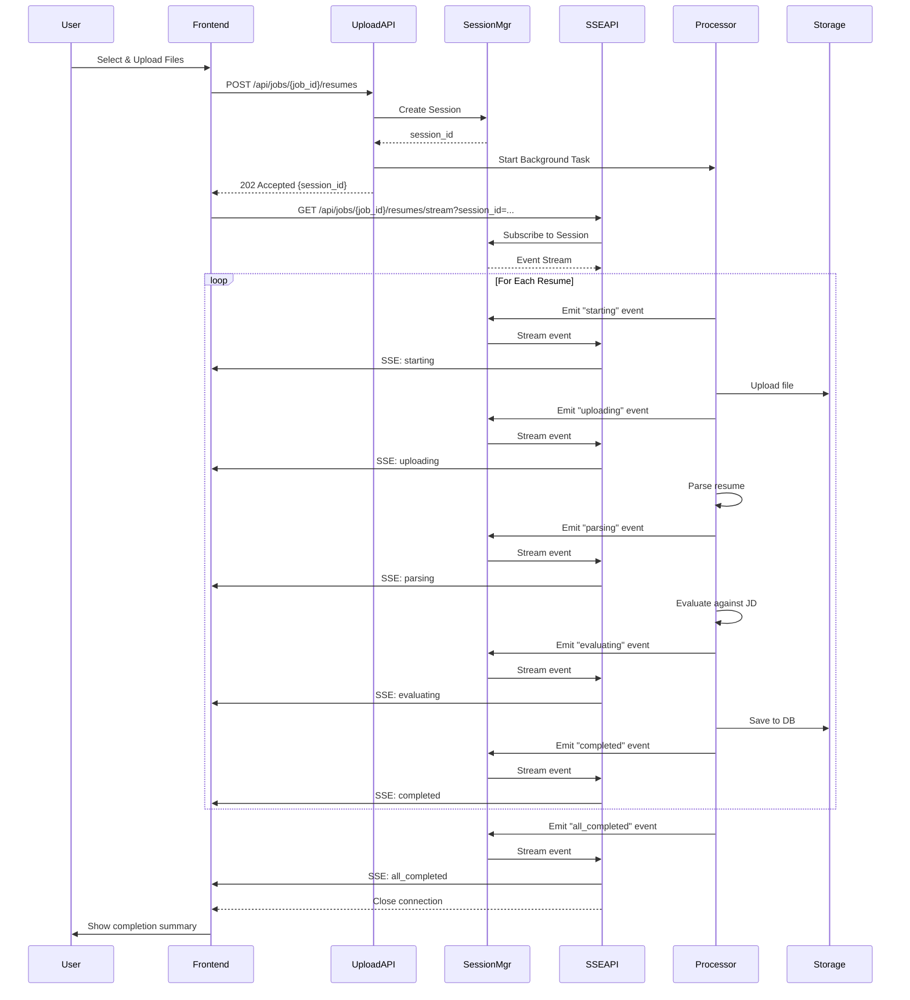
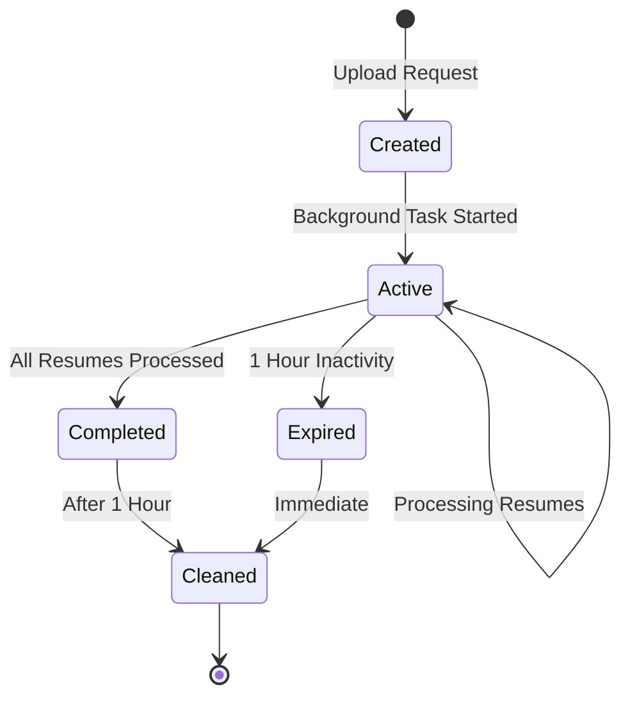
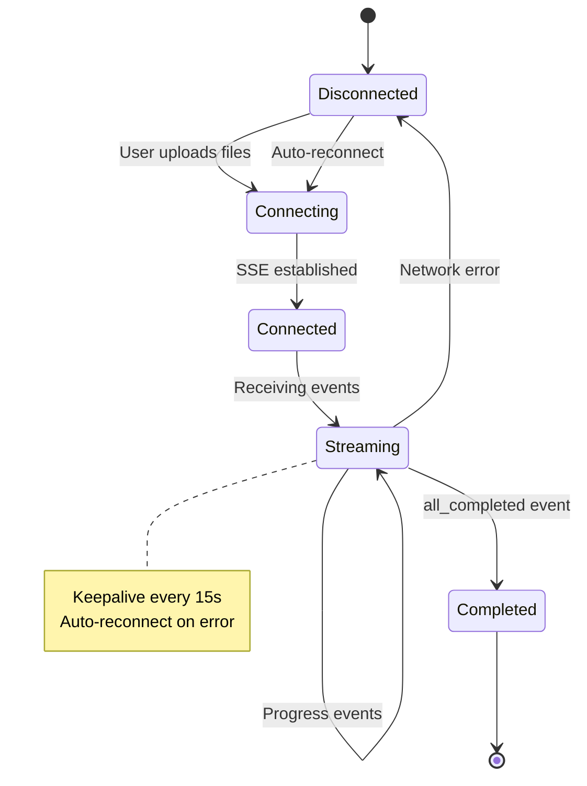
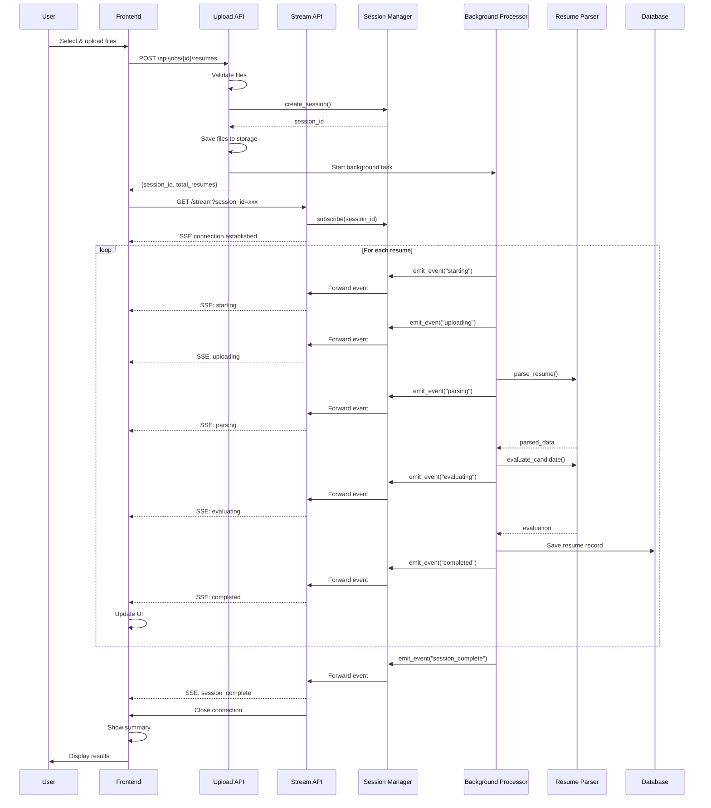
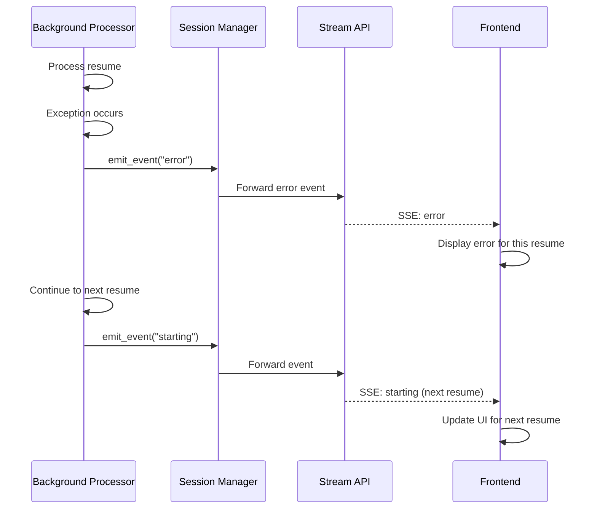
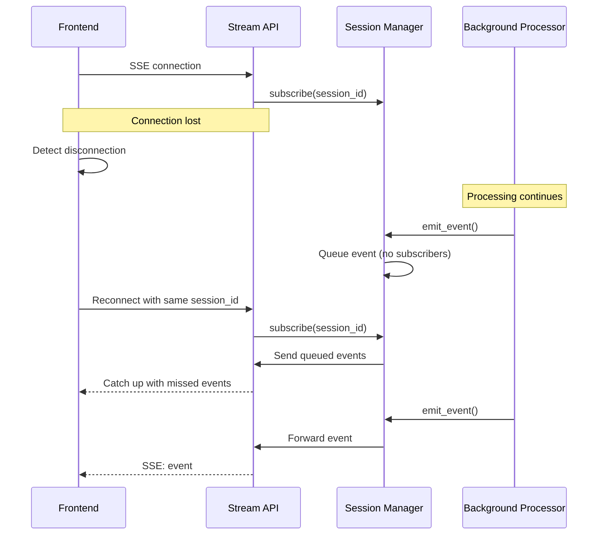

# Design Document: Resume Upload Progress Streaming

## Overview

This feature implements real-time progress streaming for resume processing using Server-Sent Events (SSE). The current implementation processes resumes synchronously and provides only a simulated progress bar on the frontend. This design introduces a true streaming architecture where users receive live updates about which resume is being processed, what stage it's in, and whether any errors occur.

### Key Design Goals

1. **Real-time Visibility**: Users see exactly which resume is being processed and at what stage
2. **Sequential Processing**: Resumes are processed one at a time to provide clear, predictable progress updates
3. **Error Resilience**: Individual resume failures don't stop the entire batch from processing
4. **Connection Management**: Robust handling of disconnections, reconnections, and timeouts
5. **Session Isolation**: Multiple concurrent upload sessions can run independently

### Technology Stack

- **Backend**: FastAPI with SSE (Server-Sent Events) using `sse-starlette`
- **Frontend**: React with native EventSource API for SSE consumption
- **Session Management**: In-memory session store with TTL-based cleanup
- **Background Processing**: Python asyncio tasks for non-blocking resume processing

## Architecture

### High-Level Architecture

```mermaid
graph TB
    subgraph Frontend["Frontend (React)"]
        UI[ResumeUploader Component]
        SSE[EventSource Client]
        State[Progress State Manager]
    end
    
    subgraph Backend["Backend (FastAPI)"]
        Upload[Upload Endpoint<br/>/api/jobs/{job_id}/resumes]
        Stream[SSE Endpoint<br/>/api/jobs/{job_id}/resumes/stream]
        SessionMgr[Session Manager]
        Processor[Resume Processor]
        Emitter[Progress Emitter]
    end
    
    subgraph Storage["Storage Layer"]
        DB[(PostgreSQL)]
        Files[File Storage]
    end
    
    UI -->|1. Upload Files| Upload
    Upload -->|2. Create Session| SessionMgr
    Upload -->|3. Return session_id| UI
    UI -->|4. Connect SSE| Stream
    Stream -->|5. Validate & Subscribe| SessionMgr
    Upload -->|6. Start Background Task| Processor
    Processor -->|7. Process Each Resume| Files
    Processor -->|8. Emit Progress| Emitter
    Emitter -->|9. Send to Session| SessionMgr
    SessionMgr -->|10. Stream Events| Stream
    Stream -->|11. SSE Events| SSE
    SSE -->|12. Update UI| State
    State -->|13. Render Progress| UI
    Processor -->|14. Save Results| DB
```

### Request Flow Sequence



## Components and Interfaces

### Backend Components

#### 1. Session Manager (`app/services/resume_session_manager.py`)

Manages processing sessions and event distribution.

```python
from dataclasses import dataclass, field
from datetime import datetime, timedelta
from typing import AsyncIterator, Dict, List, Optional
import asyncio
import uuid

@dataclass
class ProgressEvent:
    """Represents a single progress event in resume processing."""
    event_type: str  # "starting", "uploading", "parsing", "evaluating", "completed", "error", "all_completed"
    session_id: str
    resume_index: int
    total_resumes: int
    filename: str
    timestamp: datetime = field(default_factory=datetime.utcnow)
    
    # Optional fields for completed/error states
    candidate_name: Optional[str] = None
    email: Optional[str] = None
    phone_number: Optional[str] = None
    matching_score: Optional[float] = None
    error_message: Optional[str] = None
    failed_stage: Optional[str] = None

@dataclass
class ProcessingSession:
    """Represents a resume processing session."""
    session_id: str
    job_id: uuid.UUID
    user_id: uuid.UUID
    total_resumes: int
    created_at: datetime = field(default_factory=datetime.utcnow)
    last_activity: datetime = field(default_factory=datetime.utcnow)
    completed: bool = False
    
    # Event queue for this session
    event_queue: asyncio.Queue = field(default_factory=asyncio.Queue)
    # Track active SSE connections
    active_connections: int = 0

class ResumeSessionManager:
    """Manages resume processing sessions and event distribution."""
    
    def __init__(self, session_ttl_seconds: int = 3600):
        self._sessions: Dict[str, ProcessingSession] = {}
        self._session_ttl = timedelta(seconds=session_ttl_seconds)
        self._cleanup_task: Optional[asyncio.Task] = None
    
    def create_session(
        self, 
        job_id: uuid.UUID, 
        user_id: uuid.UUID, 
        total_resumes: int
    ) -> str:
        """Create a new processing session and return session_id."""
        ...
    
    def get_session(self, session_id: str) -> Optional[ProcessingSession]:
        """Retrieve a session by ID."""
        ...
    
    async def emit_progress(self, session_id: str, event: ProgressEvent) -> None:
        """Emit a progress event to all subscribers of this session."""
        ...
    
    async def subscribe(self, session_id: str) -> AsyncIterator[ProgressEvent]:
        """Subscribe to progress events for a session (SSE stream)."""
        ...
    
    def mark_completed(self, session_id: str) -> None:
        """Mark a session as completed."""
        ...
    
    async def cleanup_stale_sessions(self) -> None:
        """Background task to clean up expired sessions."""
        ...
```

#### 2. Progress Emitter (`app/services/resume_progress_emitter.py`)

Convenience wrapper for emitting progress events during resume processing.

```python
from app.services.resume_session_manager import ResumeSessionManager, ProgressEvent

class ResumeProgressEmitter:
    """Helper class to emit progress events during resume processing."""
    
    def __init__(self, session_manager: ResumeSessionManager):
        self._session_manager = session_manager
    
    async def emit_starting(
        self, 
        session_id: str, 
        resume_index: int, 
        total_resumes: int, 
        filename: str
    ) -> None:
        """Emit 'starting' event."""
        ...
    
    async def emit_uploading(
        self, 
        session_id: str, 
        resume_index: int, 
        total_resumes: int, 
        filename: str
    ) -> None:
        """Emit 'uploading' event."""
        ...
    
    async def emit_parsing(
        self, 
        session_id: str, 
        resume_index: int, 
        total_resumes: int, 
        filename: str
    ) -> None:
        """Emit 'parsing' event."""
        ...
    
    async def emit_evaluating(
        self, 
        session_id: str, 
        resume_index: int, 
        total_resumes: int, 
        filename: str
    ) -> None:
        """Emit 'evaluating' event."""
        ...
    
    async def emit_completed(
        self, 
        session_id: str, 
        resume_index: int, 
        total_resumes: int, 
        filename: str,
        candidate_name: Optional[str] = None,
        email: Optional[str] = None,
        phone_number: Optional[str] = None,
        matching_score: Optional[float] = None
    ) -> None:
        """Emit 'completed' event with resume details."""
        ...
    
    async def emit_error(
        self, 
        session_id: str, 
        resume_index: int, 
        total_resumes: int, 
        filename: str,
        error_message: str,
        failed_stage: str
    ) -> None:
        """Emit 'error' event."""
        ...
    
    async def emit_all_completed(
        self, 
        session_id: str, 
        total_resumes: int
    ) -> None:
        """Emit 'all_completed' event when all resumes are processed."""
        ...
```

#### 3. Resume Processor (`app/services/resume_processor.py`)

Handles sequential resume processing with progress emission.

```python
from typing import List
from fastapi import UploadFile
import uuid

from app.services.resume_session_manager import ResumeSessionManager
from app.services.resume_progress_emitter import ResumeProgressEmitter
from app.services.storage import StorageProvider
from app.agents.resume_parser_agent import ResumeParserAgent
from app.models.resume import Resume
from sqlalchemy.ext.asyncio import AsyncSession

class ResumeProcessor:
    """Processes resumes sequentially with progress streaming."""
    
    def __init__(
        self,
        session_manager: ResumeSessionManager,
        storage: StorageProvider,
        parser: ResumeParserAgent
    ):
        self._session_manager = session_manager
        self._emitter = ResumeProgressEmitter(session_manager)
        self._storage = storage
        self._parser = parser
    
    async def process_resumes(
        self,
        session_id: str,
        job_id: uuid.UUID,
        files: List[UploadFile],
        job_description: Optional[str],
        db: AsyncSession
    ) -> None:
        """
        Process resumes sequentially, emitting progress events.
        This runs as a background task.
        """
        total_resumes = len(files)
        
        for index, file in enumerate(files):
            filename = file.filename or f"resume_{index}"
            
            try:
                # Starting
                await self._emitter.emit_starting(
                    session_id, index, total_resumes, filename
                )
                
                # Uploading
                await self._emitter.emit_uploading(
                    session_id, index, total_resumes, filename
                )
                file_path = await self._upload_file(job_id, file)
                
                # Parsing
                await self._emitter.emit_parsing(
                    session_id, index, total_resumes, filename
                )
                parsed_data = await self._parse_resume(file_path, file)
                
                # Evaluating
                if job_description and parsed_data.get("raw_text"):
                    await self._emitter.emit_evaluating(
                        session_id, index, total_resumes, filename
                    )
                    evaluation = await self._evaluate_resume(
                        parsed_data["raw_text"], job_description
                    )
                else:
                    evaluation = None
                
                # Save to database
                resume = await self._save_resume(
                    db, job_id, file_path, file, parsed_data, evaluation
                )
                
                # Completed
                await self._emitter.emit_completed(
                    session_id, index, total_resumes, filename,
                    candidate_name=resume.candidate_name,
                    email=resume.email,
                    phone_number=resume.phone_number,
                    matching_score=resume.matching_score
                )
                
            except Exception as e:
                # Error
                await self._emitter.emit_error(
                    session_id, index, total_resumes, filename,
                    error_message=str(e),
                    failed_stage=self._determine_failed_stage(e)
                )
        
        # All completed
        await self._emitter.emit_all_completed(session_id, total_resumes)
        self._session_manager.mark_completed(session_id)
    
    async def _upload_file(self, job_id: uuid.UUID, file: UploadFile) -> str:
        """Upload file to storage."""
        ...
    
    async def _parse_resume(self, file_path: str, file: UploadFile) -> dict:
        """Parse resume using ResumeParserAgent."""
        ...
    
    async def _evaluate_resume(self, raw_text: str, job_description: str) -> dict:
        """Evaluate resume against job description."""
        ...
    
    async def _save_resume(
        self, 
        db: AsyncSession, 
        job_id: uuid.UUID, 
        file_path: str, 
        file: UploadFile, 
        parsed_data: dict, 
        evaluation: Optional[dict]
    ) -> Resume:
        """Save resume to database."""
        ...
    
    def _determine_failed_stage(self, error: Exception) -> str:
        """Determine which stage failed based on exception type."""
        ...
```

#### 4. API Endpoints (`app/routers/resumes.py`)

Modified upload endpoint and new SSE streaming endpoint.

```python
from fastapi import APIRouter, Depends, File, UploadFile, BackgroundTasks
from fastapi.responses import StreamingResponse
from sse_starlette.sse import EventSourceResponse
import uuid

router = APIRouter(tags=["resumes"])

@router.post(
    "/api/jobs/{job_id}/resumes",
    status_code=202,
    response_model=dict
)
async def upload_resumes(
    job_id: uuid.UUID,
    background_tasks: BackgroundTasks,
    files: list[UploadFile] = File(...),
    db: AsyncSession = Depends(get_db),
    current_user: User = Depends(get_current_user),
    session_manager: ResumeSessionManager = Depends(get_session_manager),
    processor: ResumeProcessor = Depends(get_resume_processor)
):
    """
    Upload resumes and return session_id immediately.
    Processing happens in background with progress streaming.
    """
    # Validate job ownership
    job = await _get_owned_job(job_id, db, current_user)
    
    # Validate files
    if not files:
        raise ValidationError("At least one resume file is required")
    
    for file in files:
        _validate_resume_file(file)
    
    # Create session
    session_id = session_manager.create_session(
        job_id=job_id,
        user_id=current_user.id,
        total_resumes=len(files)
    )
    
    # Start background processing
    background_tasks.add_task(
        processor.process_resumes,
        session_id=session_id,
        job_id=job_id,
        files=files,
        job_description=job.description,
        db=db
    )
    
    return {
        "session_id": session_id,
        "total_resumes": len(files),
        "message": "Processing started"
    }

@router.get("/api/jobs/{job_id}/resumes/stream")
async def stream_resume_progress(
    job_id: uuid.UUID,
    session_id: str,
    db: AsyncSession = Depends(get_db),
    current_user: User = Depends(get_current_user),
    session_manager: ResumeSessionManager = Depends(get_session_manager)
):
    """
    SSE endpoint for streaming resume processing progress.
    """
    # Validate job ownership
    await _get_owned_job(job_id, db, current_user)
    
    # Validate session
    session = session_manager.get_session(session_id)
    if not session:
        raise NotFoundError(resource="Processing session")
    
    if session.user_id != current_user.id:
        raise PermissionError("Session does not belong to current user")
    
    # Create SSE event generator
    async def event_generator():
        async for event in session_manager.subscribe(session_id):
            yield {
                "event": event.event_type,
                "data": event.to_dict()
            }
    
    return EventSourceResponse(event_generator())
```

### Frontend Components

#### 1. SSE Client Hook (`frontend/src/hooks/useResumeProgress.ts`)

Custom React hook for managing SSE connection and progress state.

```typescript
import { useEffect, useState, useCallback, useRef } from 'react';

export interface ProgressEvent {
  event_type: string;
  session_id: string;
  resume_index: number;
  total_resumes: number;
  filename: string;
  timestamp: string;
  candidate_name?: string;
  email?: string;
  phone_number?: string;
  matching_score?: number;
  error_message?: string;
  failed_stage?: string;
}

export interface ResumeProgress {
  filename: string;
  status: 'pending' | 'starting' | 'uploading' | 'parsing' | 'evaluating' | 'completed' | 'error';
  error?: string;
  candidateName?: string;
  email?: string;
  phoneNumber?: string;
  matchingScore?: number;
}

export function useResumeProgress(jobId: string, sessionId: string | null) {
  const [resumes, setResumes] = useState<ResumeProgress[]>([]);
  const [isConnected, setIsConnected] = useState(false);
  const [isComplete, setIsComplete] = useState(false);
  const [error, setError] = useState<string | null>(null);
  const eventSourceRef = useRef<EventSource | null>(null);

  const connect = useCallback(() => {
    if (!sessionId) return;

    const url = `/api/jobs/${jobId}/resumes/stream?session_id=${sessionId}`;
    const eventSource = new EventSource(url, { withCredentials: true });
    eventSourceRef.current = eventSource;

    eventSource.onopen = () => {
      setIsConnected(true);
      setError(null);
    };

    eventSource.onerror = () => {
      setIsConnected(false);
      setError('Connection lost. Retrying...');
      // EventSource automatically reconnects
    };

    // Handle different event types
    const eventTypes = ['starting', 'uploading', 'parsing', 'evaluating', 'completed', 'error', 'all_completed'];
    
    eventTypes.forEach(eventType => {
      eventSource.addEventListener(eventType, (e: MessageEvent) => {
        const data: ProgressEvent = JSON.parse(e.data);
        
        if (eventType === 'all_completed') {
          setIsComplete(true);
          eventSource.close();
          return;
        }

        setResumes(prev => {
          const updated = [...prev];
          const index = data.resume_index;
          
          // Initialize if needed
          if (!updated[index]) {
            updated[index] = {
              filename: data.filename,
              status: 'pending'
            };
          }
          
          // Update status
          updated[index].status = eventType as ResumeProgress['status'];
          updated[index].filename = data.filename;
          
          // Add completion data
          if (eventType === 'completed') {
            updated[index].candidateName = data.candidate_name;
            updated[index].email = data.email;
            updated[index].phoneNumber = data.phone_number;
            updated[index].matchingScore = data.matching_score;
          }
          
          // Add error data
          if (eventType === 'error') {
            updated[index].error = data.error_message;
          }
          
          return updated;
        });
      });
    });

    return () => {
      eventSource.close();
    };
  }, [jobId, sessionId]);

  useEffect(() => {
    if (sessionId) {
      const cleanup = connect();
      return cleanup;
    }
  }, [sessionId, connect]);

  const disconnect = useCallback(() => {
    if (eventSourceRef.current) {
      eventSourceRef.current.close();
      eventSourceRef.current = null;
      setIsConnected(false);
    }
  }, []);

  return {
    resumes,
    isConnected,
    isComplete,
    error,
    disconnect
  };
}
```

#### 2. Updated ResumeUploader Component

Modified to use SSE for real progress tracking.

```typescript
// Key changes to ResumeUploader.tsx:
// 1. Call upload endpoint and receive session_id
// 2. Use useResumeProgress hook to connect SSE
// 3. Display real-time progress for each resume
// 4. Show completion summary when done

const [sessionId, setSessionId] = useState<string | null>(null);
const { resumes: progressResumes, isConnected, isComplete, error: streamError } = 
  useResumeProgress(jobId, sessionId);

const uploadResumes = async () => {
  if (files.length === 0) return;
  
  setIsUploading(true);
  const formData = new FormData();
  files.forEach((file) => {
    formData.append("files", file);
  });

  try {
    const response = await api.post(`/jobs/${jobId}/resumes`, formData, {
      headers: { "Content-Type": "multipart/form-data" },
    });
    
    // Receive session_id and start SSE connection
    setSessionId(response.data.session_id);
  } catch (error) {
    console.error("Upload failed", error);
    toast.error("Upload failed. Please try again.");
    setIsUploading(false);
  }
};

// Display progress for each resume
{progressResumes.map((resume, index) => (
  <div key={index} className="flex items-center gap-3">
    <FileText className="h-4 w-4" />
    <div className="flex-1">
      <div className="text-sm font-medium">{resume.filename}</div>
      <div className="text-xs text-muted-foreground">
        {resume.status === 'completed' && `✓ ${resume.candidateName || 'Completed'}`}
        {resume.status === 'error' && `✗ ${resume.error}`}
        {!['completed', 'error'].includes(resume.status) && resume.status}
      </div>
    </div>
    {resume.status === 'completed' && <CheckCircle2 className="h-4 w-4 text-green-500" />}
    {resume.status === 'error' && <XCircle className="h-4 w-4 text-red-500" />}
    {!['completed', 'error'].includes(resume.status) && <Loader2 className="h-4 w-4 animate-spin" />}
  </div>
))}
```


#### 3. Modified Upload Endpoint (`app/routers/resumes.py`)

Updated to return session_id immediately and start background processing.

```python
@router.post(
    "/api/jobs/{job_id}/resumes",
    response_model=dict,  # Returns {session_id, total_resumes}
    status_code=202,  # Accepted (processing in background)
)
async def upload_resumes(
    job_id: uuid.UUID,
    files: list[UploadFile] = File(...),
    db: AsyncSession = Depends(get_db),
    current_user: User = Depends(get_current_user),
    storage: StorageProvider = Depends(get_storage_provider),
    parser: ResumeParserAgent = Depends(get_resume_parser_agent),
):
    """Upload resumes and start background processing"""
    job = await _get_owned_job(job_id, db, current_user)
    
    if not files:
        raise ValidationError("At least one resume file is required")
    
    # Validate all files first
    validated_files = []
    for file in files:
        file_type = _validate_resume_file(file)
        validated_files.append((file, file_type))
    
    # Create session
    session_manager = get_session_manager()
    session_id = session_manager.create_session(
        job_id=str(job_id),
        user_id=str(current_user.id),
        total_resumes=len(validated_files)
    )
    
    # Save files to storage
    file_paths = []
    for file, file_type in validated_files:
        safe_name = os.path.basename(file.filename)
        destination = f"resumes/{job_id}/{uuid.uuid4()}-{safe_name}"
        saved_path = await storage.save_file(file, destination)
        file_paths.append((saved_path, file.filename, file_type))
    
    # Start background processing
    processor = ResumeBackgroundProcessor(
        session_id=session_id,
        job=job,
        file_paths=file_paths,
        db_session=db,
        storage=storage,
        parser=parser
    )
    asyncio.create_task(processor.process_all())
    
    return {
        "session_id": session_id,
        "total_resumes": len(validated_files)
    }
```

#### 4. SSE Stream Endpoint (`app/routers/resumes.py`)

New endpoint for Server-Sent Events streaming.

```python
from fastapi.responses import StreamingResponse
from app.services.resume_session_manager import get_session_manager
import json

@router.get("/api/jobs/{job_id}/resumes/stream")
async def stream_resume_progress(
    job_id: uuid.UUID,
    session_id: str,
    current_user: User = Depends(get_current_user),
    db: AsyncSession = Depends(get_db),
):
    """Stream resume processing progress via Server-Sent Events"""
    
    # Verify job ownership
    await _get_owned_job(job_id, db, current_user)
    
    # Get session
    session_manager = get_session_manager()
    session = session_manager.get_session(session_id)
    
    if not session:
        raise NotFoundError(resource="Processing session")
    
    # Verify session belongs to this job
    if session.job_id != str(job_id):
        raise NotFoundError(resource="Processing session")
    
    async def event_generator():
        """Generate SSE events"""
        try:
            async for event in session_manager.subscribe(session_id):
                # Format as SSE
                event_data = {
                    "event_type": event.event_type,
                    "session_id": event.session_id,
                    "resume_index": event.resume_index,
                    "total_resumes": event.total_resumes,
                    "filename": event.filename,
                    "timestamp": event.timestamp.isoformat(),
                }
                
                # Add optional fields
                if event.stage:
                    event_data["stage"] = event.stage
                if event.matching_score is not None:
                    event_data["matching_score"] = event.matching_score
                if event.candidate_name:
                    event_data["candidate_name"] = event.candidate_name
                if event.email:
                    event_data["email"] = event.email
                if event.phone_number:
                    event_data["phone_number"] = event.phone_number
                if event.error_message:
                    event_data["error_message"] = event.error_message
                if event.failed_stage:
                    event_data["failed_stage"] = event.failed_stage
                if event.resume_id:
                    event_data["resume_id"] = event.resume_id
                
                # SSE format: "event: <type>\ndata: <json>\n\n"
                if event.event_type == "keepalive":
                    yield f": keepalive\n\n"
                else:
                    yield f"event: {event.event_type}\n"
                    yield f"data: {json.dumps(event_data)}\n\n"
                
                # Close stream after session_complete
                if event.event_type == "session_complete":
                    break
        except asyncio.CancelledError:
            # Client disconnected
            pass
    
    return StreamingResponse(
        event_generator(),
        media_type="text/event-stream",
        headers={
            "Cache-Control": "no-cache",
            "Connection": "keep-alive",
            "X-Accel-Buffering": "no",  # Disable nginx buffering
        }
    )
```

### Frontend Components

#### 1. SSE Client Hook (`frontend/src/hooks/useResumeProgressStream.ts`)

Custom React hook for managing SSE connection.

```typescript
import { useEffect, useRef, useState } from 'react';

export interface ProgressEvent {
  event_type: string;
  session_id: string;
  resume_index: number;
  total_resumes: number;
  filename: string;
  timestamp: string;
  stage?: string;
  matching_score?: number;
  candidate_name?: string;
  email?: string;
  phone_number?: string;
  error_message?: string;
  failed_stage?: string;
  resume_id?: string;
}

export interface ResumeProgress {
  filename: string;
  status: 'pending' | 'uploading' | 'parsing' | 'evaluating' | 'completed' | 'error';
  stage?: string;
  matching_score?: number;
  candidate_name?: string;
  email?: string;
  phone_number?: string;
  error_message?: string;
  resume_id?: string;
}

interface UseResumeProgressStreamResult {
  resumes: ResumeProgress[];
  isConnected: boolean;
  isComplete: boolean;
  error: string | null;
}

export function useResumeProgressStream(
  jobId: string,
  sessionId: string | null,
  enabled: boolean
): UseResumeProgressStreamResult {
  const [resumes, setResumes] = useState<ResumeProgress[]>([]);
  const [isConnected, setIsConnected] = useState(false);
  const [isComplete, setIsComplete] = useState(false);
  const [error, setError] = useState<string | null>(null);
  const eventSourceRef = useRef<EventSource | null>(null);

  useEffect(() => {
    if (!enabled || !sessionId) {
      return;
    }

    const token = localStorage.getItem('token');
    const url = `${import.meta.env.VITE_API_URL}/api/jobs/${jobId}/resumes/stream?session_id=${sessionId}`;
    
    // EventSource doesn't support custom headers, so we pass token as query param
    // Alternative: use fetch with ReadableStream for more control
    const eventSource = new EventSource(`${url}&token=${token}`);
    eventSourceRef.current = eventSource;

    eventSource.onopen = () => {
      setIsConnected(true);
      setError(null);
    };

    eventSource.onerror = () => {
      setIsConnected(false);
      setError('Connection lost. Retrying...');
      // EventSource automatically reconnects
    };

    // Handle different event types
    const handleEvent = (event: MessageEvent) => {
      const data: ProgressEvent = JSON.parse(event.data);
      
      setResumes((prev) => {
        const updated = [...prev];
        const index = data.resume_index;
        
        // Initialize if needed
        if (!updated[index]) {
          updated[index] = {
            filename: data.filename,
            status: 'pending',
          };
        }
        
        // Update based on event type
        switch (data.event_type) {
          case 'starting':
            updated[index].status = 'uploading';
            updated[index].stage = 'starting';
            break;
          case 'uploading':
            updated[index].status = 'uploading';
            updated[index].stage = 'uploading';
            break;
          case 'parsing':
            updated[index].status = 'parsing';
            updated[index].stage = 'parsing';
            break;
          case 'evaluating':
            updated[index].status = 'evaluating';
            updated[index].stage = 'evaluating';
            break;
          case 'completed':
            updated[index].status = 'completed';
            updated[index].stage = 'completed';
            updated[index].matching_score = data.matching_score;
            updated[index].candidate_name = data.candidate_name;
            updated[index].email = data.email;
            updated[index].phone_number = data.phone_number;
            updated[index].resume_id = data.resume_id;
            break;
          case 'error':
            updated[index].status = 'error';
            updated[index].error_message = data.error_message;
            break;
        }
        
        return updated;
      });
    };

    eventSource.addEventListener('starting', handleEvent);
    eventSource.addEventListener('uploading', handleEvent);
    eventSource.addEventListener('parsing', handleEvent);
    eventSource.addEventListener('evaluating', handleEvent);
    eventSource.addEventListener('completed', handleEvent);
    eventSource.addEventListener('error', handleEvent);
    
    eventSource.addEventListener('session_complete', () => {
      setIsComplete(true);
      eventSource.close();
    });

    return () => {
      eventSource.close();
    };
  }, [jobId, sessionId, enabled]);

  return { resumes, isConnected, isComplete, error };
}
```


#### 2. Updated Resume Uploader Component (`frontend/src/components/resumes/ResumeUploader.tsx`)

Modified to use SSE streaming instead of fake progress.

```typescript
import React, { useState, useRef } from "react";
import { Upload, X, FileText, Loader2, CheckCircle2, AlertCircle } from "lucide-react";
import { Button } from "@/components/ui/button";
import { api } from "@/lib/api";
import { cn } from "@/lib/utils";
import { toast } from "sonner";
import { useResumeProgressStream } from "@/hooks/useResumeProgressStream";

interface ResumeUploaderProps {
  jobId: string;
  onUploadSuccess: () => void;
}

export function ResumeUploader({ jobId, onUploadSuccess }: ResumeUploaderProps) {
  const [isDragging, setIsDragging] = useState(false);
  const [files, setFiles] = useState<File[]>([]);
  const [sessionId, setSessionId] = useState<string | null>(null);
  const [isUploading, setIsUploading] = useState(false);
  const fileInputRef = useRef<HTMLInputElement>(null);

  // Use SSE hook for real-time progress
  const { resumes, isConnected, isComplete, error } = useResumeProgressStream(
    jobId,
    sessionId,
    isUploading
  );

  // Handle completion
  React.useEffect(() => {
    if (isComplete && sessionId) {
      const successCount = resumes.filter(r => r.status === 'completed').length;
      const errorCount = resumes.filter(r => r.status === 'error').length;
      
      toast.success(
        `Processing complete! ${successCount} succeeded, ${errorCount} failed.`
      );
      
      setFiles([]);
      setSessionId(null);
      setIsUploading(false);
      onUploadSuccess();
    }
  }, [isComplete, sessionId, resumes, onUploadSuccess]);

  const addFiles = (newFiles: File[]) => {
    const validFiles = newFiles.filter(
      (file) => file.type === "application/pdf" || file.name.endsWith(".docx")
    );

    if (validFiles.length < newFiles.length) {
      toast.error("Only PDF and DOCX files are allowed");
    }

    setFiles((prev) => {
      const existingNames = new Set(prev.map((f) => f.name));
      const uniqueNewFiles = validFiles.filter((f) => !existingNames.has(f.name));
      
      if (uniqueNewFiles.length < validFiles.length) {
        toast.info("Duplicate files were skipped");
      }
      
      return [...prev, ...uniqueNewFiles];
    });
  };

  const handleDragOver = (e: React.DragEvent) => {
    e.preventDefault();
    setIsDragging(true);
  };

  const handleDragLeave = () => {
    setIsDragging(false);
  };

  const handleDrop = (e: React.DragEvent) => {
    e.preventDefault();
    setIsDragging(false);
    if (e.dataTransfer.files) {
      addFiles(Array.from(e.dataTransfer.files));
    }
  };

  const handleFileSelect = (e: React.ChangeEvent<HTMLInputElement>) => {
    if (e.target.files) {
      addFiles(Array.from(e.target.files));
    }
    if (fileInputRef.current) fileInputRef.current.value = "";
  };

  const removeFile = (index: number) => {
    setFiles((prev) => prev.filter((_, i) => i !== index));
  };

  const uploadResumes = async () => {
    if (files.length === 0) return;

    setIsUploading(true);
    
    const formData = new FormData();
    files.forEach((file) => {
      formData.append("files", file);
    });

    try {
      const response = await api.post(`/jobs/${jobId}/resumes`, formData, {
        headers: {
          "Content-Type": "multipart/form-data",
        },
      });
      
      // Response contains session_id
      setSessionId(response.data.session_id);
      toast.info("Processing started...");
    } catch (error) {
      console.error("Upload failed", error);
      toast.error("Upload failed. Please check your connection and try again.");
      setIsUploading(false);
    }
  };

  const getStatusIcon = (status: string) => {
    switch (status) {
      case 'completed':
        return <CheckCircle2 className="h-4 w-4 text-green-500" />;
      case 'error':
        return <AlertCircle className="h-4 w-4 text-destructive" />;
      case 'uploading':
      case 'parsing':
      case 'evaluating':
        return <Loader2 className="h-4 w-4 animate-spin text-primary" />;
      default:
        return <FileText className="h-4 w-4 text-muted-foreground" />;
    }
  };

  const getStatusText = (resume: any) => {
    if (resume.status === 'error') {
      return `Error: ${resume.error_message}`;
    }
    if (resume.status === 'completed') {
      return `Score: ${resume.matching_score?.toFixed(1)}% - ${resume.candidate_name}`;
    }
    return resume.stage || resume.status;
  };

  return (
    <div className="space-y-4">
      <div
        onDragOver={handleDragOver}
        onDragLeave={handleDragLeave}
        onDrop={handleDrop}
        onClick={() => !isUploading && fileInputRef.current?.click()}
        className={cn(
          "border-2 border-dashed rounded-lg p-10 text-center cursor-pointer transition-all duration-300",
          isDragging 
            ? "border-primary bg-primary/5 scale-[1.01] shadow-inner" 
            : "border-border/60 bg-card/40 hover:border-primary/40 hover:bg-card/60",
          isUploading && "opacity-50 cursor-not-allowed pointer-events-none"
        )}
      >
        <input
          type="file"
          ref={fileInputRef}
          onChange={handleFileSelect}
          multiple
          accept=".pdf,.docx"
          className="hidden"
        />
        <div className="flex flex-col items-center gap-4">
          <div className="p-5 bg-primary/10 rounded-lg text-primary shadow-sm">
            <Upload className="h-10 w-10" />
          </div>
          <div>
            <p className="text-xl font-bold tracking-tight">Drop resumes here</p>
            <p className="text-sm text-muted-foreground font-medium mt-1">
              PDF or DOCX (max 10MB each)
            </p>
          </div>
        </div>
      </div>

      {files.length > 0 && !isUploading && (
        <div className="space-y-4 p-5 rounded-lg border border-border/50 bg-card/40">
          <div className="flex items-center justify-between">
            <h4 className="text-sm font-bold">{files.length} file(s) selected</h4>
            <Button 
              variant="ghost" 
              size="sm" 
              onClick={() => setFiles([])}
              className="h-8 text-muted-foreground hover:text-destructive"
            >
              Clear all
            </Button>
          </div>

          <div className="space-y-2 max-h-48 overflow-y-auto pr-2">
            {files.map((file, i) => (
              <div 
                key={file.name + i} 
                className="flex items-center justify-between p-3 bg-background/50 rounded-lg border"
              >
                <div className="flex items-center gap-3 overflow-hidden">
                  <FileText className="h-4 w-4 text-muted-foreground" />
                  <span className="text-sm font-semibold truncate">{file.name}</span>
                </div>
                <button 
                  onClick={() => removeFile(i)} 
                  className="p-1.5 rounded-lg hover:bg-destructive/10"
                >
                  <X className="h-4 w-4" />
                </button>
              </div>
            ))}
          </div>

          <Button 
            className="w-full h-12 text-base font-bold" 
            onClick={uploadResumes}
          >
            Process {files.length} Candidate(s)
          </Button>
        </div>
      )}

      {isUploading && resumes.length > 0 && (
        <div className="space-y-4 p-5 rounded-lg border border-primary/30 glass">
          <div className="flex items-center justify-between">
            <h4 className="text-sm font-bold">
              Processing {resumes.length} resume(s)
            </h4>
            {!isConnected && (
              <span className="text-xs text-yellow-500">Reconnecting...</span>
            )}
          </div>

          <div className="space-y-2 max-h-96 overflow-y-auto pr-2">
            {resumes.map((resume, i) => (
              <div 
                key={i} 
                className={cn(
                  "flex items-center justify-between p-3 rounded-lg border transition-all",
                  resume.status === 'completed' && "bg-green-500/10 border-green-500/30",
                  resume.status === 'error' && "bg-destructive/10 border-destructive/30",
                  resume.status !== 'completed' && resume.status !== 'error' && 
                    "bg-background/50 border-border/40"
                )}
              >
                <div className="flex items-center gap-3 overflow-hidden flex-1">
                  {getStatusIcon(resume.status)}
                  <div className="flex flex-col overflow-hidden flex-1">
                    <span className="text-sm font-semibold truncate">
                      {resume.filename}
                    </span>
                    <span className="text-xs text-muted-foreground">
                      {getStatusText(resume)}
                    </span>
                  </div>
                </div>
              </div>
            ))}
          </div>
        </div>
      )}
    </div>
  );
}
```


## Data Models

### Progress Event Schema

```python
{
  "event_type": "starting" | "uploading" | "parsing" | "evaluating" | "completed" | "error" | "all_completed",
  "session_id": "uuid-string",
  "resume_index": 0,  # 0-based index
  "total_resumes": 5,
  "filename": "john_doe_resume.pdf",
  "timestamp": "2024-01-15T10:30:00Z",
  
  # Optional fields (present in 'completed' events)
  "candidate_name": "John Doe",
  "email": "john@example.com",
  "phone_number": "+1234567890",
  "matching_score": 85.5,
  
  # Optional fields (present in 'error' events)
  "error_message": "Failed to parse PDF: corrupted file",
  "failed_stage": "parsing"
}
```

### Session Data Structure

```python
{
  "session_id": "uuid-string",
  "job_id": "uuid-string",
  "user_id": "uuid-string",
  "total_resumes": 5,
  "created_at": "2024-01-15T10:30:00Z",
  "last_activity": "2024-01-15T10:35:00Z",
  "completed": false,
  "active_connections": 1
}
```

### Upload Response Schema

```python
{
  "session_id": "uuid-string",
  "total_resumes": 5,
  "message": "Processing started"
}
```

### SSE Event Format

Server-Sent Events are transmitted in the following format:

```
event: starting
data: {"event_type":"starting","session_id":"abc-123","resume_index":0,"total_resumes":3,"filename":"resume1.pdf","timestamp":"2024-01-15T10:30:00Z"}

event: uploading
data: {"event_type":"uploading","session_id":"abc-123","resume_index":0,"total_resumes":3,"filename":"resume1.pdf","timestamp":"2024-01-15T10:30:05Z"}

event: parsing
data: {"event_type":"parsing","session_id":"abc-123","resume_index":0,"total_resumes":3,"filename":"resume1.pdf","timestamp":"2024-01-15T10:30:10Z"}

event: evaluating
data: {"event_type":"evaluating","session_id":"abc-123","resume_index":0,"total_resumes":3,"filename":"resume1.pdf","timestamp":"2024-01-15T10:30:15Z"}

event: completed
data: {"event_type":"completed","session_id":"abc-123","resume_index":0,"total_resumes":3,"filename":"resume1.pdf","timestamp":"2024-01-15T10:30:20Z","candidate_name":"John Doe","email":"john@example.com","phone_number":"+1234567890","matching_score":85.5}

event: all_completed
data: {"event_type":"all_completed","session_id":"abc-123","total_resumes":3,"timestamp":"2024-01-15T10:35:00Z"}
```

## Error Handling

### Error Categories and Handling Strategy

#### 1. Connection Errors

**Scenario**: SSE connection fails to establish or drops during processing

**Handling**:
- Frontend: EventSource automatically attempts reconnection with exponential backoff
- Frontend: Display "Connection lost. Retrying..." message to user
- Backend: Continue processing in background regardless of connection state
- Backend: Session remains active for 1 hour, allowing reconnection

**User Experience**:
- Progress is not lost if connection drops
- User can refresh page and reconnect using same session_id
- Clear visual indicator of connection status

#### 2. File Upload Errors

**Scenario**: File fails to upload to storage (network error, storage unavailable, file too large)

**Handling**:
- Backend: Catch exception during upload phase
- Backend: Emit "error" event with `failed_stage: "uploading"`
- Backend: Continue processing next resume in queue
- Frontend: Display error icon and message for failed resume
- Frontend: Continue showing progress for remaining resumes

**Recovery**: User can retry failed resumes in a new upload session

#### 3. Parsing Errors

**Scenario**: Resume file is corrupted, unsupported format, or parsing fails

**Handling**:
- Backend: Catch exception during parsing phase
- Backend: Emit "error" event with `failed_stage: "parsing"` and descriptive error message
- Backend: Save resume record with `status: "error"` in database
- Backend: Continue processing next resume
- Frontend: Display parsing error with filename

**Recovery**: User can re-upload corrected file

#### 4. Evaluation Errors

**Scenario**: AI evaluation service fails (API timeout, rate limit, service unavailable)

**Handling**:
- Backend: Catch exception during evaluation phase
- Backend: Save resume with parsed data but without matching score
- Backend: Emit "completed" event with `matching_score: null`
- Frontend: Display resume as completed but indicate evaluation unavailable
- Backend: Log error for monitoring

**Recovery**: Background job can retry evaluation later (future enhancement)

#### 5. Database Errors

**Scenario**: Database connection fails or transaction fails during save

**Handling**:
- Backend: Catch exception during database save
- Backend: Emit "error" event with `failed_stage: "saving"`
- Backend: File remains in storage for manual recovery
- Backend: Continue processing next resume
- Frontend: Display database error message

**Recovery**: Admin can manually trigger re-save from storage

#### 6. Session Not Found

**Scenario**: User connects to SSE endpoint with invalid or expired session_id

**Handling**:
- Backend: Return HTTP 404 with error message
- Frontend: Display "Session expired or not found" message
- Frontend: Prompt user to start new upload

**Prevention**: Sessions have 1-hour TTL and are cleaned up automatically

#### 7. Authentication Errors

**Scenario**: User's authentication token expires during processing

**Handling**:
- Backend: Return HTTP 401 on SSE connection attempt
- Frontend: Redirect to login page
- Backend: Continue background processing (session remains valid)
- Frontend: After re-authentication, user can reconnect with same session_id

#### 8. Concurrent Session Limit (Future Enhancement)

**Scenario**: User attempts to start too many concurrent sessions

**Handling**:
- Backend: Return HTTP 429 (Too Many Requests)
- Frontend: Display "Too many active uploads. Please wait for current uploads to complete."

### Error Event Structure

```python
{
  "event_type": "error",
  "session_id": "abc-123",
  "resume_index": 2,
  "total_resumes": 5,
  "filename": "corrupted_resume.pdf",
  "timestamp": "2024-01-15T10:32:00Z",
  "error_message": "Failed to parse PDF: file appears to be corrupted",
  "failed_stage": "parsing"
}
```

### Error Logging and Monitoring

All errors are logged with structured logging for monitoring:

```python
logger.error(
    "Resume processing failed",
    extra={
        "session_id": session_id,
        "resume_index": index,
        "filename": filename,
        "stage": failed_stage,
        "error": str(exception),
        "user_id": user_id,
        "job_id": job_id
    }
)
```

## Connection Management and Cleanup

### Session Lifecycle



### Connection Management Strategy

#### 1. Session Creation
- Session created immediately when upload endpoint is called
- Unique session_id (UUID) generated
- Session stored in memory with metadata (job_id, user_id, total_resumes, timestamps)
- Session TTL: 1 hour from last activity

#### 2. SSE Connection Lifecycle
- Frontend establishes EventSource connection after receiving session_id
- Backend validates session exists and belongs to authenticated user
- Backend increments `active_connections` counter for session
- Connection remains open until processing completes or client disconnects

#### 3. Keepalive Mechanism
- Backend sends keepalive comment every 15 seconds: `: keepalive\n\n`
- Prevents proxy/firewall timeouts
- Helps detect client disconnections
- Does not trigger frontend event handlers (SSE comment format)

```python
async def event_generator():
    last_keepalive = time.time()
    
    async for event in session_manager.subscribe(session_id):
        yield {"event": event.event_type, "data": event.to_dict()}
        last_keepalive = time.time()
    
    # Send keepalive if no events for 15 seconds
    while not session.completed:
        if time.time() - last_keepalive > 15:
            yield {": keepalive\n\n"}
            last_keepalive = time.time()
        await asyncio.sleep(5)
```

#### 4. Disconnection Handling

**Client-Initiated Disconnection**:
- EventSource.close() called by frontend
- Backend detects broken pipe on next write attempt
- Backend decrements `active_connections` counter
- Background processing continues unaffected

**Server-Initiated Disconnection**:
- Processing completes: backend sends "all_completed" event and closes stream
- Session expires: backend closes all active connections for that session

**Network Disconnection**:
- EventSource automatically attempts reconnection
- Backend continues processing and queuing events
- On reconnection, client receives queued events (if still in memory)

#### 5. Reconnection Support

Frontend reconnection logic:

```typescript
const eventSource = new EventSource(url, { withCredentials: true });

eventSource.onerror = () => {
  setIsConnected(false);
  setError('Connection lost. Retrying...');
  // EventSource automatically reconnects with exponential backoff
  // No manual intervention needed
};

eventSource.onopen = () => {
  setIsConnected(true);
  setError(null);
};
```

Backend supports reconnection:
- Same session_id can be used to reconnect
- Events are queued in memory (asyncio.Queue)
- New connection receives events from queue
- If queue is full or session expired, client sees stale data warning

#### 6. Session Cleanup

**Automatic Cleanup Task**:
```python
async def cleanup_stale_sessions(self) -> None:
    """Background task runs every 5 minutes."""
    while True:
        await asyncio.sleep(300)  # 5 minutes
        
        now = datetime.utcnow()
        expired_sessions = []
        
        for session_id, session in self._sessions.items():
            # Clean up if completed and older than 1 hour
            if session.completed and (now - session.last_activity) > self._session_ttl:
                expired_sessions.append(session_id)
            
            # Clean up if inactive for 1 hour (even if not completed)
            elif (now - session.last_activity) > self._session_ttl:
                expired_sessions.append(session_id)
        
        for session_id in expired_sessions:
            del self._sessions[session_id]
            logger.info(f"Cleaned up expired session: {session_id}")
```

**Manual Cleanup**:
- User can close browser tab/window - session remains active for TTL
- User can explicitly disconnect - frontend calls disconnect() method
- Admin can clear sessions via management endpoint (future enhancement)

#### 7. Resource Limits

**Per-Session Limits**:
- Maximum resumes per session: 100 (configurable)
- Maximum event queue size: 1000 events
- Session TTL: 1 hour (configurable)

**Global Limits**:
- Maximum concurrent sessions per user: 10 (future enhancement)
- Maximum total active sessions: 1000 (future enhancement)
- Memory limit for session storage: Monitor and alert if exceeds threshold

#### 8. Graceful Shutdown

On application shutdown:
```python
async def shutdown_session_manager():
    """Close all active connections and save session state."""
    for session_id, session in session_manager._sessions.items():
        # Send shutdown event to all connected clients
        await session_manager.emit_progress(
            session_id,
            ProgressEvent(
                event_type="shutdown",
                session_id=session_id,
                resume_index=0,
                total_resumes=session.total_resumes,
                filename="",
                error_message="Server is shutting down. Please reconnect in a moment."
            )
        )
        
        # Close all connections
        session.event_queue.put_nowait(None)  # Signal end of stream
    
    # Wait for background tasks to complete (with timeout)
    await asyncio.wait_for(
        asyncio.gather(*background_tasks, return_exceptions=True),
        timeout=30
    )
```

### Connection State Diagram



## Correctness Properties

*A property is a characteristic or behavior that should hold true across all valid executions of a system—essentially, a formal statement about what the system should do. Properties serve as the bridge between human-readable specifications and machine-verifiable correctness guarantees.*

**Note on Testing Approach:** This feature is infrastructure-heavy (SSE streaming, session management, background tasks, I/O operations) and not suitable for traditional property-based testing with 100+ randomized iterations. However, the properties below represent invariants and behaviors that must hold consistently. These will be validated through integration tests and example-based tests rather than pure property-based tests.

### Property 1: Sequential Processing Order Preservation

*For any* list of resumes submitted in a processing session, the system SHALL process them sequentially in the exact order they were uploaded, with only one resume being processed at any given time, and the next resume SHALL begin processing immediately after the previous one completes.

**Validates: Requirements 2.1, 2.2, 2.3, 2.4**

### Property 2: Complete Stage Event Emission

*For any* resume being processed, the system SHALL emit stage events in the correct sequence: "starting" (with filename), "uploading", "parsing", "evaluating", and either "completed" (with matching score and candidate details) or "error" (with error details and failed stage).

**Validates: Requirements 3.1, 3.2, 3.3, 3.4, 3.5, 3.6**

### Property 3: Event Structure Consistency

*For any* progress event emitted by the system, the event SHALL follow SSE format with event type and JSON data, and SHALL include resume identifier, filename, current stage, timestamp, total_resumes, and current_resume_index.

**Validates: Requirements 4.1, 4.2, 4.5**

### Property 4: Completion Event Data Completeness

*For any* resume that completes successfully, the completion event SHALL include matching_score, candidate_name, email, and phone_number in the event data.

**Validates: Requirements 4.3**

### Property 5: Error Event Data Completeness

*For any* resume that encounters an error during processing, the error event SHALL include error_message and failed_stage in the event data.

**Validates: Requirements 4.4**

### Property 6: Error Resilience and Continuation

*For any* processing session where one or more resumes fail, the system SHALL emit an error event for each failed resume, continue processing subsequent resumes in the queue, and SHALL NOT terminate the progress stream due to individual resume errors.

**Validates: Requirements 6.1, 6.2, 6.3**

### Property 7: UI State Synchronization

*For any* progress event received by the frontend, the UI SHALL update the corresponding resume's status in real-time and display the current stage name for the resume being processed.

**Validates: Requirements 5.2, 5.4**

### Property 8: Session Summary Accuracy

*For any* completed processing session, the frontend SHALL display a summary showing the correct count of successful and failed resumes, with error details displayed for failed resumes.

**Validates: Requirements 5.5, 6.4, 6.5**

### Property 9: Session ID Uniqueness and Association

*For any* resume upload request, the system SHALL generate a unique session_id and associate all subsequent progress events for that upload batch with that session_id.

**Validates: Requirements 8.1, 8.4**

### Property 10: Authorization Validation

*For any* SSE stream connection request, the system SHALL validate that the job_id belongs to the authenticated user before streaming progress, and SHALL accept any valid session_id parameter.

**Validates: Requirements 7.2, 7.3**

### Property 11: File Validation

*For any* file uploaded to the resume upload endpoint, the system SHALL validate file type and size before accepting the upload.

**Validates: Requirements 8.5**

### Property 12: Processing Independence from Connection State

*For any* processing session, background resume processing SHALL continue to completion even if the frontend client disconnects from the progress stream.

**Validates: Requirements 9.3**

### Property 13: Session Isolation

*For any* set of concurrent processing sessions, the system SHALL isolate progress events by session_id such that when a client connects with a specific session_id, it receives only events for that session.

**Validates: Requirements 10.2, 10.3**

### Property 14: Concurrent Session Support with Sequential Processing

*For any* set of concurrent processing sessions for the same user, the system SHALL process resumes sequentially within each individual session while allowing parallel processing across different sessions.

**Validates: Requirements 10.1, 10.4**

## Testing Strategy

### Testing Approach

This feature is **not suitable for property-based testing** because it primarily involves:
- Infrastructure orchestration (SSE connections, background tasks)
- Stateful session management with side effects
- I/O operations (file uploads, database writes, API calls)
- Event streaming and connection lifecycle management

Instead, we use:
- **Unit tests** with mocks for individual components
- **Integration tests** for end-to-end flows
- **Manual testing** for connection handling and edge cases

### Unit Tests

#### Backend Unit Tests

1. **Session Manager Tests** (`tests/services/test_resume_session_manager.py`)
   - Test session creation with valid parameters
   - Test session retrieval by ID
   - Test session not found returns None
   - Test event emission to session queue
   - Test multiple subscribers receive same events
   - Test session completion marking
   - Test stale session cleanup after TTL
   - Test concurrent session isolation

2. **Progress Emitter Tests** (`tests/services/test_resume_progress_emitter.py`)
   - Test each event type emission (starting, uploading, parsing, evaluating, completed, error)
   - Test event data structure correctness
   - Test timestamp generation
   - Test optional fields in completed/error events

3. **Resume Processor Tests** (`tests/services/test_resume_processor.py`)
   - Test sequential processing of multiple resumes
   - Test progress emission at each stage
   - Test error handling for upload failures
   - Test error handling for parsing failures
   - Test error handling for evaluation failures
   - Test continuation after individual resume failure
   - Test all_completed emission after last resume
   - Test database transaction handling

#### Frontend Unit Tests

1. **useResumeProgress Hook Tests** (`frontend/src/hooks/__tests__/useResumeProgress.test.ts`)
   - Test SSE connection establishment
   - Test event handling for each event type
   - Test resume state updates on events
   - Test connection error handling
   - Test reconnection logic
   - Test cleanup on unmount
   - Test multiple resume tracking

2. **ResumeUploader Component Tests** (`frontend/src/components/resumes/__tests__/ResumeUploader.test.tsx`)
   - Test file selection and validation
   - Test upload initiation
   - Test session_id reception
   - Test progress display for each resume
   - Test completion summary display
   - Test error display for failed resumes

### Integration Tests

1. **End-to-End Upload Flow** (`tests/integration/test_resume_upload_streaming.py`)
   - Upload multiple resumes and verify session creation
   - Connect to SSE endpoint and verify events received
   - Verify sequential processing order
   - Verify all resumes saved to database
   - Verify SSE connection closes after completion

2. **Error Recovery Flow** (`tests/integration/test_resume_error_handling.py`)
   - Upload batch with one corrupted file
   - Verify error event emitted for corrupted file
   - Verify processing continues for remaining files
   - Verify partial success in database

3. **Reconnection Flow** (`tests/integration/test_resume_reconnection.py`)
   - Start upload and establish SSE connection
   - Simulate network disconnection
   - Verify automatic reconnection
   - Verify events received after reconnection

4. **Concurrent Sessions** (`tests/integration/test_concurrent_sessions.py`)
   - Start multiple upload sessions for same user
   - Verify session isolation
   - Verify correct events routed to each session
   - Verify no cross-contamination

### Manual Testing Checklist

- [ ] Upload single resume and verify all stages displayed
- [ ] Upload multiple resumes and verify sequential processing
- [ ] Upload batch with one invalid file and verify error handling
- [ ] Disconnect network during processing and verify reconnection
- [ ] Refresh page during processing and verify reconnection with same session
- [ ] Upload resumes for multiple jobs simultaneously
- [ ] Verify session cleanup after 1 hour
- [ ] Verify keepalive prevents timeout on slow processing
- [ ] Test with large files (near 10MB limit)
- [ ] Test with many files (50+ resumes)

### Performance Testing

1. **Load Testing**
   - Simulate 100 concurrent users uploading resumes
   - Measure SSE connection overhead
   - Measure memory usage for session storage
   - Verify no memory leaks over extended period

2. **Stress Testing**
   - Upload 100 resumes in single session
   - Verify event queue doesn't overflow
   - Measure processing time per resume
   - Verify database connection pool handling

## Implementation Notes

### Dependencies

**Backend**:
- `sse-starlette`: SSE support for FastAPI
- `asyncio`: Background task management
- Existing: `fastapi`, `sqlalchemy`, `pydantic`

**Frontend**:
- Native `EventSource` API (no additional dependencies)
- Existing: `react`, `typescript`

### Configuration

Add to `app/config.py`:

```python
class Settings(BaseSettings):
    # ... existing settings ...
    
    # Resume processing settings
    RESUME_SESSION_TTL_SECONDS: int = 3600  # 1 hour
    RESUME_MAX_PER_SESSION: int = 100
    RESUME_KEEPALIVE_INTERVAL_SECONDS: int = 15
    RESUME_EVENT_QUEUE_SIZE: int = 1000
```

### Database Migrations

No database schema changes required. Existing `Resume` model already has all necessary fields.

### Deployment Considerations

1. **Stateful Sessions**: Session manager stores state in memory
   - For multi-instance deployment, use Redis for session storage
   - Or use sticky sessions to route same session_id to same instance

2. **WebSocket Alternative**: If SSE is blocked by corporate firewalls
   - Implement WebSocket fallback
   - Use same event structure

3. **Monitoring**:
   - Track active session count
   - Track average processing time per resume
   - Alert on high error rates
   - Monitor memory usage for session storage

4. **Scaling**:
   - Background processing can be moved to Celery workers
   - Session manager can be moved to Redis
   - SSE endpoint can scale horizontally with Redis pub/sub

### Future Enhancements

1. **Persistent Session Storage**: Move from in-memory to Redis for multi-instance support
2. **Resume Processing Queue**: Use Celery for better resource management
3. **Batch Retry**: Allow user to retry all failed resumes in one click
4. **Progress Persistence**: Save progress events to database for historical view
5. **Concurrent Processing**: Process multiple resumes in parallel (with progress aggregation)
6. **WebSocket Fallback**: Support WebSocket for environments where SSE is blocked
7. **Rate Limiting**: Limit concurrent sessions per user
8. **Admin Dashboard**: View all active sessions and processing status

---

**Document Version**: 1.0  
**Last Updated**: 2024-01-15  
**Author**: AI Design Agent  
**Status**: Ready for Review

## Data Models

### Progress Event Schema

```typescript
interface ProgressEvent {
  event_type: 'starting' | 'uploading' | 'parsing' | 'evaluating' | 'completed' | 'error' | 'session_complete' | 'keepalive';
  session_id: string;
  resume_index: number;
  total_resumes: number;
  filename: string;
  timestamp: string;  // ISO 8601 format
  
  // Optional fields based on event_type
  stage?: string;
  matching_score?: number;
  candidate_name?: string;
  email?: string;
  phone_number?: string;
  error_message?: string;
  failed_stage?: string;
  resume_id?: string;
}
```

### Session Schema

```python
@dataclass
class ProcessingSession:
    session_id: str
    job_id: str
    user_id: str
    total_resumes: int
    created_at: datetime
    event_queue: Queue[ProgressEvent]
    completed: bool
    subscribers: int
```

### Upload Response Schema

```typescript
interface UploadResponse {
  session_id: string;
  total_resumes: number;
}
```

## Sequence Diagrams

### Complete Upload and Streaming Flow



### Error Handling Flow



### Reconnection Flow



## Error Handling

### Error Categories and Responses

| Error Type | HTTP Status | Handling Strategy |
|------------|-------------|-------------------|
| Invalid file type | 400 | Reject before upload, show validation error |
| File too large | 413 | Reject before upload, show size limit |
| Session not found | 404 | Show error, allow retry |
| Job not found | 404 | Show error, redirect to jobs list |
| Unauthorized | 401 | Redirect to login |
| Parsing error | 200 (SSE error event) | Emit error event, continue processing |
| Evaluation error | 200 (SSE error event) | Emit error event, save partial data |
| Database error | 200 (SSE error event) | Emit error event, retry once |
| Connection lost | N/A | Auto-reconnect with exponential backoff |

### Error Event Structure

```typescript
{
  event_type: "error",
  session_id: "uuid",
  resume_index: 2,
  total_resumes: 5,
  filename: "resume.pdf",
  timestamp: "2024-01-15T10:30:00Z",
  error_message: "Failed to parse PDF: corrupted file",
  failed_stage: "parsing"
}
```

### Frontend Error Display

- **Individual resume errors**: Show inline with resume item, allow download of original file
- **Connection errors**: Show reconnection status, auto-retry
- **Session errors**: Show error modal with retry option
- **Validation errors**: Show before upload starts

### Backend Error Recovery

```python
async def _process_single_resume(self, ...):
    try:
        # Stage 1: Starting
        await self.session_manager.emit_event(...)
        
        # Stage 2: Parsing
        try:
            parsed = await self.parser.parse_resume(file_path, file_type)
        except Exception as e:
            await self.session_manager.emit_event(
                ProgressEvent(
                    event_type="error",
                    error_message=str(e),
                    failed_stage="parsing"
                )
            )
            # Save with error status
            resume = Resume(status="error", error_details=str(e))
            self.db_session.add(resume)
            return  # Skip to next resume
        
        # Stage 3: Evaluating
        try:
            evaluation = await self.parser.evaluate_candidate_against_jd(...)
        except Exception as e:
            # Partial save: parsed data without evaluation
            resume = Resume(
                parsed_data=parsed,
                status="partial",
                error_details=f"Evaluation failed: {e}"
            )
            self.db_session.add(resume)
            await self.session_manager.emit_event(
                ProgressEvent(
                    event_type="error",
                    error_message=f"Evaluation failed: {e}",
                    failed_stage="evaluating"
                )
            )
            return
        
        # Success
        resume = Resume(parsed_data=parsed, matching_score=evaluation.score)
        self.db_session.add(resume)
        await self.session_manager.emit_event(
            ProgressEvent(event_type="completed", ...)
        )
        
    except Exception as e:
        # Unexpected error
        await self.session_manager.emit_event(
            ProgressEvent(
                event_type="error",
                error_message=f"Unexpected error: {e}",
                failed_stage="unknown"
            )
        )
```


## Testing Strategy

### Unit Tests

#### Backend Unit Tests

1. **Session Manager Tests** (`tests/services/test_resume_session_manager.py`)
   - Test session creation and retrieval
   - Test event emission and queuing
   - Test subscriber management
   - Test session cleanup
   - Test concurrent session isolation

2. **Background Processor Tests** (`tests/services/test_resume_background_processor.py`)
   - Test sequential processing order
   - Test event emission at each stage
   - Test error handling and continuation
   - Test database transaction handling
   - Mock parser and storage dependencies

3. **Upload Endpoint Tests** (`tests/routers/test_resumes_upload.py`)
   - Test file validation
   - Test session creation
   - Test background task initiation
   - Test response format
   - Test authentication and authorization

4. **Stream Endpoint Tests** (`tests/routers/test_resumes_stream.py`)
   - Test SSE connection establishment
   - Test event streaming
   - Test session validation
   - Test keepalive events
   - Test connection cleanup

#### Frontend Unit Tests

1. **SSE Hook Tests** (`frontend/src/hooks/__tests__/useResumeProgressStream.test.ts`)
   - Test connection establishment
   - Test event handling
   - Test state updates
   - Test reconnection logic
   - Test cleanup on unmount

2. **Component Tests** (`frontend/src/components/resumes/__tests__/ResumeUploader.test.tsx`)
   - Test file selection and validation
   - Test upload initiation
   - Test progress display
   - Test error display
   - Test completion handling

### Integration Tests

1. **End-to-End Upload Flow** (`tests/integration/test_resume_upload_flow.py`)
   - Upload multiple resumes
   - Establish SSE connection
   - Verify all events received in order
   - Verify database records created
   - Verify files saved to storage

2. **Error Recovery Flow** (`tests/integration/test_resume_error_handling.py`)
   - Upload mix of valid and invalid resumes
   - Verify error events emitted
   - Verify processing continues after errors
   - Verify partial data saved correctly

3. **Reconnection Flow** (`tests/integration/test_resume_reconnection.py`)
   - Start upload and streaming
   - Disconnect client mid-processing
   - Reconnect with same session_id
   - Verify catch-up events received
   - Verify no events lost

4. **Concurrent Sessions** (`tests/integration/test_concurrent_sessions.py`)
   - Start multiple upload sessions
   - Verify event isolation
   - Verify no cross-session contamination
   - Verify independent completion

### Manual Testing Checklist

- [ ] Upload single resume, verify all stages shown
- [ ] Upload multiple resumes, verify sequential processing
- [ ] Upload invalid file, verify error handling
- [ ] Disconnect during processing, verify reconnection
- [ ] Upload while another session active, verify isolation
- [ ] Close browser tab during processing, verify background continuation
- [ ] Reconnect after processing complete, verify completion event
- [ ] Test with slow network, verify keepalive events
- [ ] Test with large files (near 10MB limit)
- [ ] Test with corrupted PDF/DOCX files

### Performance Testing

1. **Load Test**: Upload 50 resumes simultaneously
   - Verify all process successfully
   - Measure average processing time per resume
   - Monitor memory usage
   - Monitor database connection pool

2. **Stress Test**: Multiple concurrent sessions
   - 10 users uploading 10 resumes each
   - Verify no session cross-contamination
   - Verify no memory leaks
   - Verify cleanup of completed sessions

3. **Endurance Test**: Long-running session
   - Upload 100 resumes in single session
   - Verify SSE connection stability
   - Verify no memory growth
   - Verify cleanup after completion

## Security Considerations

### Authentication and Authorization

1. **Token Validation**: 
   - Upload endpoint requires valid JWT token
   - Stream endpoint requires valid JWT token
   - Session ownership validated against user_id

2. **Session Isolation**:
   - Sessions scoped to user_id
   - Cannot access other users' sessions
   - Job ownership verified before streaming

3. **File Validation**:
   - File type whitelist (PDF, DOCX only)
   - File size limit (10MB)
   - Filename sanitization to prevent path traversal

### Data Protection

1. **Sensitive Data Handling**:
   - Resume content not logged
   - Error messages sanitized (no file paths exposed)
   - Session data cleaned up after TTL

2. **Storage Security**:
   - Files saved with UUID prefixes
   - Storage path not exposed in API responses
   - File access controlled by authentication

### Rate Limiting

```python
from slowapi import Limiter
from slowapi.util import get_remote_address

limiter = Limiter(key_func=get_remote_address)

@router.post("/api/jobs/{job_id}/resumes")
@limiter.limit("10/minute")  # Max 10 upload sessions per minute
async def upload_resumes(...):
    ...

@router.get("/api/jobs/{job_id}/resumes/stream")
@limiter.limit("20/minute")  # Max 20 SSE connections per minute
async def stream_resume_progress(...):
    ...
```

### Input Validation

```python
from pydantic import BaseModel, validator

class UploadRequest(BaseModel):
    files: List[UploadFile]
    
    @validator('files')
    def validate_files(cls, files):
        if len(files) > 50:
            raise ValueError("Maximum 50 files per upload")
        
        for file in files:
            if file.size > 10 * 1024 * 1024:  # 10MB
                raise ValueError(f"File {file.filename} exceeds 10MB limit")
            
            ext = Path(file.filename).suffix.lower()
            if ext not in {'.pdf', '.docx'}:
                raise ValueError(f"File {file.filename} has invalid type")
        
        return files
```

## Deployment Considerations

### Environment Variables

```bash
# Session management
RESUME_SESSION_TTL_HOURS=1
RESUME_SESSION_CLEANUP_INTERVAL_MINUTES=5

# Processing limits
MAX_RESUMES_PER_UPLOAD=50
MAX_RESUME_FILE_SIZE_MB=10
RESUME_PROCESSING_TIMEOUT_SECONDS=300

# SSE configuration
SSE_KEEPALIVE_INTERVAL_SECONDS=15
SSE_CONNECTION_TIMEOUT_SECONDS=3600
```

### Infrastructure Requirements

1. **Application Server**:
   - Support for long-lived HTTP connections (SSE)
   - Disable response buffering for SSE endpoints
   - Configure connection timeout > processing time

2. **Reverse Proxy (Nginx)**:
   ```nginx
   location /api/jobs/*/resumes/stream {
       proxy_pass http://backend;
       proxy_http_version 1.1;
       proxy_set_header Connection "";
       proxy_buffering off;
       proxy_cache off;
       proxy_read_timeout 3600s;
       chunked_transfer_encoding off;
   }
   ```

3. **Load Balancer**:
   - Sticky sessions for SSE connections
   - Health check excludes SSE endpoint
   - Connection timeout > 1 hour

### Scaling Considerations

#### Current Design (In-Memory Sessions)
- **Pros**: Simple, no external dependencies, fast
- **Cons**: Sessions lost on restart, not horizontally scalable
- **Suitable for**: MVP, single-server deployments

#### Future: Redis-Based Sessions
```python
import redis.asyncio as redis
import json

class RedisSessionManager:
    def __init__(self, redis_url: str):
        self.redis = redis.from_url(redis_url)
    
    async def create_session(self, job_id: str, user_id: str, total_resumes: int) -> str:
        session_id = str(uuid.uuid4())
        session_data = {
            "job_id": job_id,
            "user_id": user_id,
            "total_resumes": total_resumes,
            "created_at": datetime.utcnow().isoformat(),
            "completed": False
        }
        await self.redis.setex(
            f"session:{session_id}",
            timedelta(hours=1),
            json.dumps(session_data)
        )
        return session_id
    
    async def emit_event(self, session_id: str, event: ProgressEvent):
        # Publish to Redis pub/sub channel
        await self.redis.publish(
            f"session:{session_id}:events",
            json.dumps(event.__dict__)
        )
    
    async def subscribe(self, session_id: str) -> AsyncIterator[ProgressEvent]:
        pubsub = self.redis.pubsub()
        await pubsub.subscribe(f"session:{session_id}:events")
        
        async for message in pubsub.listen():
            if message["type"] == "message":
                event_data = json.loads(message["data"])
                yield ProgressEvent(**event_data)
```

**Benefits of Redis approach**:
- Horizontal scaling across multiple servers
- Session persistence across restarts
- Centralized event distribution
- Better observability

### Monitoring and Observability

1. **Metrics to Track**:
   - Active SSE connections count
   - Active processing sessions count
   - Average resume processing time
   - Error rate by stage
   - Session cleanup rate

2. **Logging**:
   ```python
   import structlog
   
   logger = structlog.get_logger()
   
   # Log session lifecycle
   logger.info("session_created", session_id=session_id, total_resumes=total)
   logger.info("resume_processing_started", session_id=session_id, filename=filename)
   logger.info("resume_processing_completed", session_id=session_id, duration_ms=duration)
   logger.error("resume_processing_failed", session_id=session_id, error=str(e))
   logger.info("session_completed", session_id=session_id, success_count=success, error_count=errors)
   ```

3. **Health Checks**:
   ```python
   @router.get("/health/resume-processing")
   async def resume_processing_health():
       session_manager = get_session_manager()
       active_sessions = len(session_manager._sessions)
       
       return {
           "status": "healthy",
           "active_sessions": active_sessions,
           "max_sessions": 100,  # Alert if exceeded
       }
   ```

## Migration Path

### Phase 1: Backend Implementation (Week 1)
1. Implement Session Manager
2. Implement Background Processor
3. Update Upload Endpoint
4. Implement SSE Stream Endpoint
5. Add unit tests

### Phase 2: Frontend Implementation (Week 1)
1. Implement SSE Hook
2. Update Resume Uploader Component
3. Add loading and error states
4. Add unit tests

### Phase 3: Integration and Testing (Week 2)
1. Integration tests
2. Manual testing
3. Performance testing
4. Bug fixes

### Phase 4: Deployment (Week 2)
1. Deploy to staging
2. Smoke tests
3. Deploy to production
4. Monitor metrics

### Rollback Plan
- Keep old synchronous endpoint as fallback
- Feature flag to toggle between old/new flow
- Monitor error rates and rollback if > 5%

```python
from app.config import get_settings

settings = get_settings()

@router.post("/api/jobs/{job_id}/resumes")
async def upload_resumes(...):
    if settings.ENABLE_STREAMING_UPLOAD:
        # New SSE-based flow
        return await upload_resumes_streaming(...)
    else:
        # Old synchronous flow
        return await upload_resumes_sync(...)
```


## Correctness Properties

*A property is a characteristic or behavior that should hold true across all valid executions of a system—essentially, a formal statement about what the system should do. Properties serve as the bridge between human-readable specifications and machine-verifiable correctness guarantees.*

### Property Reflection

After analyzing all acceptance criteria, the following redundancies were identified:

- **Requirement 2.4** (maintain processing order) is logically equivalent to **Requirement 2.1** (process sequentially in order) - both test the same ordering invariant
- **Requirement 6.1** (emit error event on failure) is identical to **Requirement 3.6** (emit error event with details)
- **Requirement 6.5** (show success/failure summary) is the same as **Requirement 5.5** (display summary with counts)
- **Requirement 10.3** (send only session events) is redundant with **Requirement 10.2** (isolate events by session_id)

These redundant properties have been consolidated into single comprehensive properties below.

### Property 1: Connection Lifecycle

*For any* processing session, the SSE connection SHALL remain open from establishment until a session_complete event is emitted, regardless of individual resume errors.

**Validates: Requirements 1.2, 1.5, 6.3**

### Property 2: Connection Confirmation

*For any* SSE connection establishment, a connection confirmation event SHALL be sent immediately after the connection is opened.

**Validates: Requirement 1.3**

### Property 3: Sequential Processing Order

*For any* list of uploaded resumes within a session, the processing order SHALL match the upload order exactly.

**Validates: Requirements 2.1, 2.4**

### Property 4: Single Resume Processing

*For any* processing session at any point in time, at most one resume SHALL have a "processing" status (uploading, parsing, or evaluating).

**Validates: Requirement 2.2**

### Property 5: Immediate Next Resume Start

*For any* non-final resume completion within a session, the next resume SHALL begin processing within 100 milliseconds.

**Validates: Requirement 2.3**

### Property 6: Stage Event Emission

*For any* resume that progresses through processing stages, events SHALL be emitted in the sequence: starting → uploading → parsing → evaluating → (completed | error).

**Validates: Requirements 3.1, 3.2, 3.3, 3.4**

### Property 7: Completed Event Fields

*For any* successfully processed resume, the "completed" event SHALL include matching_score, candidate_name, email, and phone_number fields.

**Validates: Requirements 3.5, 4.3**

### Property 8: Error Event Emission and Recovery

*For any* resume that fails during processing, an "error" event SHALL be emitted with error_message and failed_stage, AND processing SHALL continue with the next resume in the queue.

**Validates: Requirements 3.6, 6.1, 6.2**

### Property 9: SSE Format Compliance

*For any* progress event emitted, the event SHALL follow SSE format: `event: <type>\ndata: <json>\n\n` where json contains valid JSON.

**Validates: Requirement 4.1**

### Property 10: Required Event Fields

*For any* progress event, the event data SHALL include session_id, resume_index, total_resumes, filename, and timestamp fields.

**Validates: Requirements 4.2, 4.5**

### Property 11: Error Event Fields

*For any* "error" event, the event data SHALL include error_message and failed_stage fields.

**Validates: Requirement 4.4**

### Property 12: UI State Synchronization

*For any* progress event received by the frontend, the corresponding resume's UI state SHALL update to reflect the event within one render cycle.

**Validates: Requirement 5.2**

### Property 13: Stage Display

*For any* resume in a processing state (uploading, parsing, evaluating), the current stage name SHALL be displayed in the UI.

**Validates: Requirement 5.4**

### Property 14: Summary Calculation

*For any* completed session, the displayed success_count plus error_count SHALL equal total_resumes.

**Validates: Requirements 5.5, 6.5**

### Property 15: Session Authorization

*For any* SSE stream request with a job_id not owned by the authenticated user, the server SHALL return HTTP 403 or 404.

**Validates: Requirements 7.3, 7.5**

### Property 16: Authentication Requirement

*For any* SSE stream request without a valid authentication token, the server SHALL return HTTP 401.

**Validates: Requirement 7.4**

### Property 17: Unique Session Generation

*For any* resume upload request, a unique session_id SHALL be generated that does not collide with any existing active session.

**Validates: Requirement 8.1**

### Property 18: Immediate Upload Response

*For any* resume upload request, the HTTP response SHALL be returned within 1 second, regardless of the number of resumes uploaded.

**Validates: Requirement 8.2**

### Property 19: Background Task Initiation

*For any* successful upload request, background processing SHALL be initiated and progress events SHALL begin flowing within 2 seconds.

**Validates: Requirement 8.3**

### Property 20: Event Session Association

*For any* progress event emitted during a session, the event's session_id field SHALL match the session's identifier.

**Validates: Requirement 8.4**

### Property 21: File Validation

*For any* uploaded file with an invalid type (not PDF or DOCX) or size (> 10MB), the upload request SHALL be rejected with HTTP 400.

**Validates: Requirement 8.5**

### Property 22: Keepalive Timing

*For any* active processing session, keepalive events SHALL be sent at intervals of 15 seconds (±2 seconds) while processing is ongoing.

**Validates: Requirement 9.1**

### Property 23: Disconnection Detection

*For any* client disconnection, the server SHALL detect the disconnection and stop attempting to send events to that client within 30 seconds.

**Validates: Requirement 9.2**

### Property 24: Processing Independence

*For any* client disconnection during processing, background processing SHALL continue and database records SHALL be created for all resumes.

**Validates: Requirement 9.3**

### Property 25: Reconnection Session Continuity

*For any* client reconnection attempt, the same session_id SHALL be used in the request to resume receiving progress updates.

**Validates: Requirement 9.5**

### Property 26: Concurrent Session Support

*For any* user, multiple concurrent processing sessions SHALL be supported, with each session processing independently.

**Validates: Requirements 10.1, 10.4**

### Property 27: Event Isolation

*For any* two concurrent sessions, progress events SHALL not cross-contaminate—each session SHALL only receive events with its own session_id.

**Validates: Requirements 10.2, 10.3**

### Property 28: Session Cleanup

*For any* processing session, session data SHALL be cleaned up within 5 minutes after completion or after 1 hour of inactivity.

**Validates: Requirement 10.5**


## Implementation Notes

### Property-Based Testing Configuration

All property-based tests SHALL be implemented using the appropriate PBT library for the language:
- **Backend (Python)**: Use `hypothesis` library
- **Frontend (TypeScript)**: Use `fast-check` library

Each property test SHALL:
- Run a minimum of 100 iterations
- Include a comment tag referencing the design property
- Use appropriate generators for test data

Example backend property test:

```python
from hypothesis import given, strategies as st
import pytest

# Feature: resume-upload-progress-streaming, Property 3: Sequential Processing Order
@given(st.lists(st.text(min_size=1), min_size=1, max_size=20))
async def test_sequential_processing_order(resume_filenames):
    """For any list of uploaded resumes, processing order matches upload order"""
    session_id = await create_test_session(resume_filenames)
    
    events = []
    async for event in stream_events(session_id):
        if event.event_type == "starting":
            events.append(event.filename)
        if event.event_type == "session_complete":
            break
    
    assert events == resume_filenames
```

Example frontend property test:

```typescript
import fc from 'fast-check';

// Feature: resume-upload-progress-streaming, Property 12: UI State Synchronization
test('UI updates for any progress event', () => {
  fc.assert(
    fc.property(
      fc.record({
        event_type: fc.constantFrom('uploading', 'parsing', 'evaluating', 'completed'),
        resume_index: fc.nat(50),
        filename: fc.string(),
      }),
      (event) => {
        const { result } = renderHook(() => useResumeProgressStream(jobId, sessionId, true));
        
        act(() => {
          simulateSSEEvent(event);
        });
        
        const resume = result.current.resumes[event.resume_index];
        expect(resume.status).toBe(event.event_type);
      }
    ),
    { numRuns: 100 }
  );
});
```

### Alternative Testing Strategies

For criteria not suitable for property-based testing:

**Example-Based Unit Tests** (Requirements 1.4, 5.1, 6.4, 7.1):
- Test specific scenarios with concrete examples
- Focus on edge cases and error conditions
- Use mocking for external dependencies

**Integration Tests** (Requirements 9.4):
- Test end-to-end flows with real components
- Verify system behavior under realistic conditions
- Use test databases and storage

**Manual Testing** (Requirement 5.3):
- Visual inspection of UI states
- Accessibility testing
- Cross-browser compatibility

### Testing Strategy Summary

| Test Type | Count | Coverage |
|-----------|-------|----------|
| Property-Based Tests | 28 | Core business logic and invariants |
| Example-Based Unit Tests | 15 | Specific scenarios and edge cases |
| Integration Tests | 8 | End-to-end flows |
| Manual Tests | 5 | UI/UX and visual design |

**Total Test Coverage Target**: 90% code coverage, 100% requirement coverage

