# Call V2 — End-to-End Flow Diagram

Traces a single call from the UI button press through Exotel, the v2 runtime, STT, agent, TTS, and persistence.

```mermaid
sequenceDiagram
    actor User as 👤 User (Dashboard)
    participant UI as Frontend<br/>(ResumeDetailModal)
    participant API as calls.py<br/>(start_call)
    participant TEL as ExotelProvider<br/>(telephony.py)
    participant EXT as Exotel Network
    participant VWH as Voice Webhook<br/>(main.py)
    participant WSH as WS Handler<br/>(exotel_webhooks.py)
    participant V2 as CallV2WebSocketRuntime<br/>+ CallSession
    participant DG as Deepgram STT
    participant OAI as OpenAI<br/>(Agent + TTS)
    participant DB as PostgreSQL

    %% ─── PHASE 1: INITIATION ───────────────────────────────────────────
    rect rgb(30, 40, 70)
        note over User,DB: Phase 1 — Initiation
        User->>UI: Click "Call" button
        UI->>API: POST /api/resumes/{id}/calls/start<br/>{ phone_number }
        API->>DB: Validate resume, no active call, questions exist
        API->>DB: INSERT Call<br/>{ status=pending, voice_runtime=call_v2, provider=exotel }
        API->>TEL: build_urls(resume_id)
        TEL-->>API: answer_url = {PUBLIC_URL}/webhooks/exotel/voice/{resume_id}
        API->>TEL: start_outbound_call(to_number, answer_url, ...)
        TEL->>EXT: POST /v1/Accounts/{sid}/Calls/connect.json<br/>{ From, CallerId, Url, CustomField=resume_id, Record=true }
        EXT-->>TEL: { CallSid, Status }
        API->>DB: UPDATE Call { provider_call_id=CallSid, status=in-progress }
        API-->>UI: CallStartResponse
        UI-->>User: Toast "Call started"
    end

    %% ─── PHASE 2: EXOTEL DIALS OUT ─────────────────────────────────────
    rect rgb(20, 60, 40)
        note over EXT,VWH: Phase 2 — Exotel Dials the Candidate
        EXT->>User: 📞 Ring candidate phone
        User->>EXT: Pick up
        EXT->>VWH: POST /webhooks/exotel/voice/{resume_id}<br/>{ CallSid, CustomField, ... }
        VWH->>VWH: Resolve + cache CallSid → resume_id
        VWH-->>EXT: JSON { "url": "wss://…/ws/exotel-media/voice/{resume_id}" }
    end

    %% ─── PHASE 3: WEBSOCKET & SESSION SETUP ────────────────────────────
    rect rgb(70, 40, 20)
        note over EXT,DB: Phase 3 — WebSocket Connect & Session Setup
        EXT->>WSH: WS CONNECT /ws/exotel-media/voice/{resume_id}
        note over WSH: accept() immediately<br/>(Exotel 403s if handshake is slow)
        WSH->>WSH: Resolve resume UUID<br/>(path → query params → memory cache → DB)
        WSH->>V2: get_call_v2_runtime().handle(ws, resume_id, provider="exotel")
        V2->>DB: load_call_v2_context()<br/>Resume + Job + Questions + Call
        V2->>V2: Create DeepgramStreamingSttEngine<br/>{ nova-2-phonecall, L16 8kHz, endpointing=500ms }
        V2->>V2: Create OpenAITtsEngine + StructuredModelAgentRunner
        V2->>V2: Create CallSession<br/>{ ExotelMediaTelephonyAdapter,<br/>  raw_audio_cancels_tentative_turns=False }
        V2->>V2: Start clock_loop() — ticks every 100 ms
    end

    %% ─── PHASE 4: STREAM START & OPENER ────────────────────────────────
    rect rgb(60, 20, 60)
        note over EXT,DB: Phase 4 — Stream Start & Opener
        EXT->>V2: { event:"start", stream_sid, leg_sid,<br/>  media_format:{ encoding:"base64", sample_rate:8000 } }
        V2->>DB: mark_call_started()
        note over V2: State: WAITING_FOR_STREAM → LISTENING
        V2->>OAI: Agent run — "greet candidate, ask for consent"<br/>(generation_id=0, speculative=false)
        OAI-->>V2: { spoken_text, action:"continue" }
        V2->>DB: INSERT CallMessage { role=assistant, opener text }
        V2->>OAI: TTS generate(opener text) → L16 PCM stream
        note over V2: State: LISTENING → AGENT_RUNNING → SPEAKING<br/>endpointing.mark_assistant_speaking(True)
        loop Audio frames
            V2->>EXT: { event:"media", payload:base64(PCM chunk) }
        end
        EXT->>User: 🔊 Hears opener / consent request
    end

    %% ─── PHASE 5: CANDIDATE SPEAKS → STT ───────────────────────────────
    rect rgb(20, 50, 60)
        note over User,V2: Phase 5 — Candidate Speaks → STT Pipeline
        User->>EXT: 🎙 Speaks ("Yes. Go ahead.")
        loop Continuous media stream
            EXT->>V2: { event:"media", payload:base64(L16 PCM) }
            note over V2: raw_audio_cancels_tentative_turns=False<br/>→ frames forwarded to STT, never cancel pending turn
            V2->>DG: Send L16 PCM bytes
        end
        note over V2,DG: First audio frame triggers lazy Deepgram WS open<br/>wss://api.deepgram.com/v1/listen?encoding=linear16&sample_rate=8000<br/>&model=nova-2-phonecall&interim_results=true&endpointing=500
        note over V2: TTS finishes → State: SPEAKING → POST_TTS_GUARD<br/>endpointing.mark_assistant_speaking(False)
    end

    %% ─── PHASE 6: ENDPOINTING & SPECULATION ────────────────────────────
    rect rgb(60, 55, 10)
        note over DG,V2: Phase 6 — Deepgram Events → Speculative Turn
        DG-->>V2: stt.speech_started
        note over V2: State: POST_TTS_GUARD → LISTENING
        DG-->>V2: stt.interim_transcript { text:"Yes go ah…" }
        DG-->>V2: stt.final_segment { text:"Yes. Go ahead.", confidence:0.95 }
        DG-->>V2: stt.tentative_endpoint { silence_ms:500 }
        note over V2: EndpointingController.on_tentative_endpoint()<br/>generation_id=1, confirmation_deadline=now+800ms<br/>State: LISTENING → SPECULATING
        V2->>OAI: Agent run (speculative=true, gen_id=1)<br/>conversation so far + "Yes. Go ahead."
        OAI-->>V2: { spoken_text:"Great! First question…", action:"continue" }
        note over V2: Result stored — NOT committed, NOT spoken yet
    end

    %% ─── PHASE 7: CONFIRMATION ──────────────────────────────────────────
    rect rgb(20, 60, 30)
        note over V2,DB: Phase 7 — Confirmation → Commit → Speak
        note over V2: clock_loop fires:<br/>now_ms > confirmation_deadline, no fresh audio<br/>→ TurnConfirmed { generation_id=1 }<br/>State: SPECULATING → AGENT_RUNNING
        V2->>DB: INSERT CallMessage { role=user, "Yes. Go ahead." }
        V2->>DB: INSERT CallMessage { role=assistant, question text }
        note over V2: Reuse speculative result (fingerprint match)<br/>→ no second LLM call
        V2->>OAI: TTS generate(question text) → L16 PCM stream
        note over V2: State: AGENT_RUNNING → SPEAKING
        loop Audio frames
            V2->>EXT: { event:"media", payload:base64(PCM chunk) }
        end
        EXT->>User: 🔊 Hears next interview question
    end

    %% ─── PHASE 7b: OPTIONAL BARGE-IN ───────────────────────────────────
    opt Candidate interrupts while assistant is speaking
        User->>EXT: 🎙 Speaks mid-TTS
        DG-->>V2: stt.final_segment { text:"Wait, I wanted to add…" }
        note over V2: State=SPEAKING → _handle_transcript_barge_in()<br/>audio_resolver.cancel(generation_id)
        V2->>EXT: { event:"clear", stream_sid }
        note over V2: State: SPEAKING → LISTENING<br/>Barge-in text enters endpointing as new turn
    end

    %% ─── PHASE 8: CALL ENDS ─────────────────────────────────────────────
    rect rgb(70, 20, 20)
        note over EXT,DB: Phase 8 — Call Ends
        alt Candidate hangs up
            User->>EXT: 📵 Hang up
            EXT->>V2: { event:"stop", reason:"caller_hangup" }
        else Agent ends call
            note over V2: action="end_call_after_speaking"<br/>→ result.end_call=True after TTS completes
        end
        V2->>DG: Close Deepgram WebSocket
        V2->>DB: mark_call_ended(reason, ended_at_ms)
        V2->>DB: persist_call_v2_trace_summary()<br/>→ latency_metrics["call_v2"]["trace_summary"]
        note over V2: State: → ENDING → ENDED
        EXT->>VWH: POST /webhooks/exotel/status<br/>{ CallSid, Status, Duration }
        VWH->>DB: UPDATE Call { status=completed, duration_seconds }
        VWH->>EXT: Fetch recording URL (up to 3 retries)
        VWH->>DB: UPDATE Call { recording_url }
    end
```

## Key Design Decisions Visible in the Flow

| Decision | Where | Why |
|---|---|---|
| `websocket.accept()` before DB work | Phase 3, WSH | Exotel closes the connection if the handshake takes > ~1 s |
| Resume UUID fallback chain | Phase 3, WSH | Exotel mangles the WS path in some flow configurations |
| Lazy Deepgram WS open | Phase 5 | Deepgram times out if opened before audio arrives |
| `raw_audio_cancels_tentative_turns=False` | Phase 5 | Exotel sends continuous frames after endpoint; only STT events cancel |
| Speculative agent run | Phase 6 | Agent runs during silence window; result reused on confirm → latency hidden |
| Fingerprint check on confirm | Phase 7 | Ensures speculative result matches actual confirmed text before reuse |
| Trace summary persisted on end | Phase 8 | Enables post-call debugging without replaying live events |
