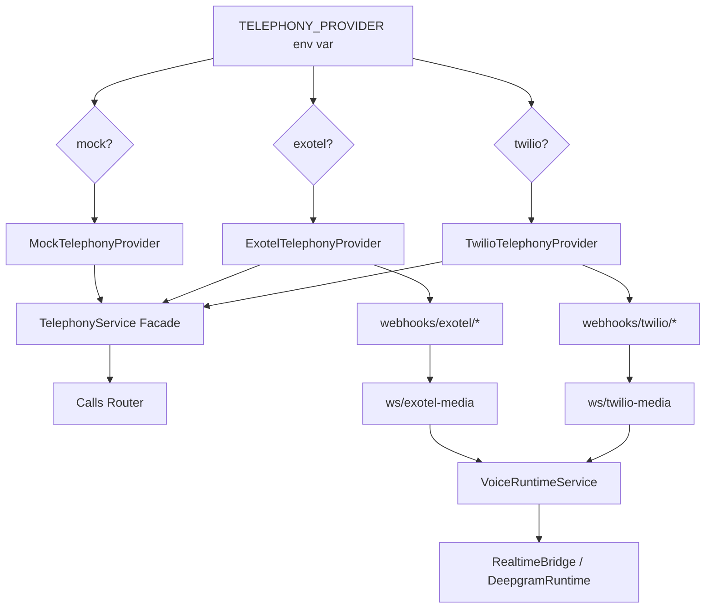

# Exotel Integration Plan — Multi-Provider Telephony Abstraction

## Objective
Add Exotel as a second telephony provider alongside Twilio, controlled by `TELEPHONY_PROVIDER` env var (`twilio` | `exotel` | `mock`). Both providers remain fully functional — no Twilio code is removed.

---

## Architecture Overview



---

## Key Protocol Differences

| Aspect | Twilio | Exotel |
|---|---|---|
| **Call initiation** | `client.calls.create(to, from_, url, ...)` | `POST /v2/accounts/{sid}/calls` + separate `start_stream` |
| **Call control markup** | TwiML (`<Response><Connect><Stream>`) | ExoML (similar XML) or API-driven applet flow |
| **Media stream initiation** | TwiML `<Connect><Stream url="wss://...">` | `POST /legs/{leg_sid}/actions/start_stream` |
| **WebSocket audio format** | µ-law 8kHz, base64, 20ms chunks | 16-bit PCM 8kHz LE, base64, 100ms chunks (3200 bytes) |
| **WS incoming event schema** | `{"event":"media","media":{"payload":"..."}}` | `{"event":"media","media":{"payload":"...","chunk":N}}` |
| **WS outgoing event schema** | `{"event":"media","streamSid":"...","media":{"payload":"..."}}` | `{"event":"media","stream_sid":"...","media":{"payload":"...","chunk":N}}` |
| **Clear/barge-in** | `{"event":"clear","streamSid":"..."}` | `{"event":"clear","stream_sid":"..."}` |
| **Stream ID field** | `streamSid` | `stream_sid` |
| **Call ID field** | `callSid` (in `start.callSid`) | `call_sid` or `leg_sid` |
| **Status callbacks** | Webhook POST with `CallSid`, `CallStatus` form fields | Webhook POST with `CallSid`, `Status` (verify exact field names) |
| **Recording** | Built-in `record=True` + recording webhook | API: `POST /legs/{leg_sid}/actions/start_recording` |
| **Auth** | Account SID + Auth Token | API Key + API Token (Basic auth) |

---

## Phase 1: Environment & Configuration
**Files:** [config.py](file:///Users/mac/RecruiteAI/backend/app/config.py), `.env`

### Changes to `config.py`
Add Exotel configuration block alongside existing Twilio block:

```python
# --- Exotel ---
EXOTEL_ACCOUNT_SID: str = ""
EXOTEL_API_KEY: str = ""
EXOTEL_API_TOKEN: str = ""
EXOTEL_PHONE_NUMBER: str = ""           # Exotel CLI/DID number
EXOTEL_SUBDOMAIN: str = "api.exotel.com"  # or region-specific
EXOTEL_ESTIMATED_COST_PER_MINUTE_USD: float = 0.005  # ~₹0.40/min
EXOTEL_VALIDATE_SIGNATURES: bool = False
```

Update `TELEPHONY_PROVIDER` comment:
```python
TELEPHONY_PROVIDER: str = "twilio"  # twilio, exotel, mock
```

### Changes to `.env`
```env
# Telephony Provider Selection
TELEPHONY_PROVIDER=twilio  # Change to "exotel" to switch

# Exotel Credentials (populate when ready)
EXOTEL_ACCOUNT_SID=
EXOTEL_API_KEY=
EXOTEL_API_TOKEN=
EXOTEL_PHONE_NUMBER=
EXOTEL_SUBDOMAIN=api.exotel.com
```

### Verification
- [ ] App boots with `TELEPHONY_PROVIDER=twilio` (existing behavior unchanged)
- [ ] App boots with `TELEPHONY_PROVIDER=exotel` (no crash, falls back to mock if no creds)
- [ ] `get_settings()` returns new Exotel fields

---

## Phase 2: Exotel Telephony Provider
**Files:** [telephony.py](file:///Users/mac/RecruiteAI/backend/app/services/telephony.py)

### New class: `ExotelTelephonyProvider`

```python
class ExotelTelephonyProvider:
    provider_name = "exotel"
    enable_mock_progression = False

    def __init__(self) -> None:
        self.mock_mode = bool(
            not settings.EXOTEL_ACCOUNT_SID
            or not settings.EXOTEL_API_KEY
            or not settings.EXOTEL_API_TOKEN
            or not settings.EXOTEL_PHONE_NUMBER
        )
        self._base_url = f"https://{settings.EXOTEL_SUBDOMAIN}/v2/accounts/{settings.EXOTEL_ACCOUNT_SID}"
        self._auth = (settings.EXOTEL_API_KEY, settings.EXOTEL_API_TOKEN)

    def build_urls(self, *, resume_id: uuid.UUID) -> OutboundCallUrls:
        base = settings.PUBLIC_URL.rstrip("/")
        return OutboundCallUrls(
            answer_url=f"{base}/webhooks/exotel/voice?call_resume_id={resume_id}",
            status_callback_url=f"{base}/webhooks/exotel/status",
            recording_callback_url=f"{base}/webhooks/exotel/recording",
        )

    def start_outbound_call(self, *, to_number, answer_url, status_callback_url, recording_callback_url=None) -> OutboundCallResult:
        if self.mock_mode:
            return MockTelephonyProvider().start_outbound_call(...)
        # Exotel REST API call
        # POST /v2/accounts/{sid}/calls
        ...

    def start_stream(self, *, leg_sid: str, websocket_url: str) -> str:
        """Exotel-specific: start bi-directional media stream on a call leg."""
        # POST /v2/accounts/{sid}/legs/{leg_sid}/actions/start_stream
        ...

    def end_call(self, call_sid: str) -> None: ...
    def say_and_hangup(self, call_sid: str, message: str) -> None: ...
    def start_recording(self, call_sid: str, callback_url=None) -> None: ...
```

### Update `TelephonyService.__init__`
```python
if provider_name == "twilio":
    self._provider = TwilioTelephonyProvider()
elif provider_name == "exotel":
    self._provider = ExotelTelephonyProvider()
else:
    self._provider = MockTelephonyProvider()
```

### Verification
- [ ] `TelephonyService` with `TELEPHONY_PROVIDER=exotel` instantiates `ExotelTelephonyProvider`
- [ ] Mock fallback works when Exotel creds are missing
- [ ] `build_urls()` returns `/webhooks/exotel/...` paths

---

## Phase 3: Exotel Webhooks Router
**New file:** `backend/app/routers/exotel_webhooks.py`

This mirrors [twilio_webhooks.py](file:///Users/mac/RecruiteAI/backend/app/routers/twilio_webhooks.py) but handles Exotel's event format.

### Endpoints

| Endpoint | Purpose |
|---|---|
| `POST /webhooks/exotel/voice` | Answer webhook — initiates `start_stream` to our WSS endpoint |
| `POST /webhooks/exotel/status` | Call status updates (maps Exotel statuses to our internal statuses) |
| `POST /webhooks/exotel/recording` | Recording completion callback |
| `POST /webhooks/exotel/stream-status` | Media stream lifecycle events |
| `WS /ws/exotel-media/{resume_id}` | Bi-directional audio WebSocket |

### Key differences from Twilio webhook

1. **Voice webhook**: Instead of returning TwiML with `<Connect><Stream>`, we:
   - Accept the incoming webhook (which gives us a `leg_sid`)
   - Call Exotel's `start_stream` API to attach our WSS endpoint
   - Return a simple ExoML response (or 200 OK)

2. **Status webhook**: Map Exotel-specific status strings to our internal status enum

3. **WebSocket handler**: Translate Exotel's event format:
   - `stream_sid` → our internal `stream_id`  
   - `call_sid` / `leg_sid` → `provider_call_id`
   - Audio format: PCM 16-bit → may need conversion to µ-law for OpenAI Realtime

### Exotel Status Mapping
```python
EXOTEL_STATUS_MAP = {
    "ringing": "ringing",
    "in-progress": "in_progress",
    "completed": "completed",
    "busy": "failed",
    "failed": "failed",
    "no-answer": "no_answer",
    "canceled": "failed",
}
```

### Registration in `main.py`
```python
from app.routers import exotel_webhooks
app.include_router(exotel_webhooks.router)
```

### Verification
- [ ] Exotel webhook endpoints are registered and reachable
- [ ] Status webhook correctly updates call records
- [ ] WebSocket endpoint accepts connections

---

## Phase 4: Media Stream Protocol Adapter
**Files:** [realtime_bridge.py](file:///Users/mac/RecruiteAI/backend/app/services/realtime_bridge.py), [deepgram_runtime.py](file:///Users/mac/RecruiteAI/backend/app/services/deepgram_runtime.py)

### Problem
The `RealtimeBridge` currently has Twilio-specific WebSocket event handling baked in. We need to make the three provider-specific methods truly provider-aware:

```python
# Current (Twilio-only):
_build_audio_event()       → {"event":"media","streamSid":"...","media":{"payload":"..."}}
_build_clear_audio_event() → {"event":"clear","streamSid":"..."}
_extract_stream_id()       → payload.get("streamSid")
_extract_provider_call_id() → payload.get("start",{}).get("callSid")
```

### Solution: Make these methods branch on `provider`

```python
@staticmethod
def _build_audio_event(*, provider: str, stream_id: str, payload: str) -> dict:
    if provider == "exotel":
        return {
            "event": "media",
            "stream_sid": stream_id,
            "media": {"payload": payload},
        }
    # Default: Twilio format
    return {
        "event": "media",
        "streamSid": stream_id,
        "media": {"payload": payload},
    }

@staticmethod
def _build_clear_audio_event(*, provider: str, stream_id: str) -> dict:
    if provider == "exotel":
        return {"event": "clear", "stream_sid": stream_id}
    return {"event": "clear", "streamSid": stream_id}

@staticmethod
def _extract_stream_id(payload: dict) -> str | None:
    return (
        payload.get("streamSid")
        or payload.get("stream_sid")
        or payload.get("start", {}).get("streamId")
        or payload.get("start", {}).get("stream_sid")
    )

@staticmethod
def _extract_provider_call_id(*, provider: str, payload: dict) -> str | None:
    start = payload.get("start", {})
    return start.get("callSid") or start.get("call_sid") or start.get("leg_sid")
```

### Audio Format Consideration

> [!IMPORTANT]
> **Exotel uses 16-bit PCM 8kHz** while **Twilio uses µ-law 8kHz**. OpenAI Realtime API expects `audio/pcmu` (µ-law).
> 
> Options:
> 1. **Convert at the WebSocket handler level** — add `audioop.lin2ulaw()` / `audioop.ulaw2lin()` in the Exotel media path
> 2. **Request µ-law from Exotel** — check if `content_type: "audio/x-mulaw;rate=8000"` is supported in `start_stream`
> 
> **Recommendation**: Try option 2 first (request µ-law from Exotel). If not supported, implement option 1 with `audioop` (or `struct` for manual conversion).

### Verification
- [ ] `_build_audio_event(provider="exotel", ...)` returns Exotel-formatted event
- [ ] `_extract_stream_id` works for both Twilio and Exotel payloads
- [ ] Audio from Exotel WS is correctly forwarded to OpenAI Realtime
- [ ] Audio from OpenAI Realtime is correctly forwarded back to Exotel WS

---

## Phase 5: Pricing & Cost Estimation
**Files:** [pricing.py](file:///Users/mac/RecruiteAI/backend/app/services/pricing.py)

### Update `estimate_telephony_cost()`
```python
def estimate_telephony_cost(*, provider: str, duration_seconds: int | None) -> float:
    minutes = _safe_float(duration_seconds) / 60.0
    rate = 0.0
    if provider == "twilio":
        rate = settings.TWILIO_ESTIMATED_COST_PER_MINUTE_USD
    elif provider == "exotel":
        rate = settings.EXOTEL_ESTIMATED_COST_PER_MINUTE_USD
    return _round_currency(minutes * rate)
```

### Verification
- [ ] Cost breakdown for Exotel calls shows correct estimated cost
- [ ] Twilio cost calculation remains unchanged

---

## Phase 6: Database & Call Model
**Files:** [call.py](file:///Users/mac/RecruiteAI/backend/app/models/call.py), [calls.py](file:///Users/mac/RecruiteAI/backend/app/routers/calls.py)

### Minimal Changes
The `Call` model already has:
- `provider: str` — will store `"exotel"` 
- `provider_call_id: str` — will store Exotel's `call_sid` or `leg_sid`
- `twilio_call_sid: str` — remains Twilio-specific (nullable, unused for Exotel)

> [!NOTE]
> No schema migration needed. The existing columns accommodate Exotel naturally. The `twilio_call_sid` column stays for backward compatibility; it's simply `None` for Exotel calls.

### Update in calls router
In [calls.py](file:///Users/mac/RecruiteAI/backend/app/routers/calls.py#L211-L215), update the webhook verification check:

```python
if (
    getattr(telephony, "provider_name", "") in ("twilio", "exotel")
    and not getattr(telephony, "enable_mock_progression", False)
):
    await _verify_public_webhook_endpoint()
```

And the `twilio_call_sid` assignment at [line 231](file:///Users/mac/RecruiteAI/backend/app/routers/calls.py#L231):
```python
twilio_call_sid=outbound.call_sid if outbound.provider == "twilio" else None,
```

### Recording proxy
In [get_call_recording](file:///Users/mac/RecruiteAI/backend/app/routers/calls.py#L307-L344), add Exotel auth:
```python
if call.provider == "exotel":
    client_kwargs["auth"] = (settings.EXOTEL_API_KEY, settings.EXOTEL_API_TOKEN)
```

### Verification
- [ ] Exotel calls create `Call` records with `provider="exotel"`
- [ ] `twilio_call_sid` is `None` for Exotel calls
- [ ] Recording proxy works for both providers

---

## Phase 7: Signature Verification
**New file (optional):** `backend/app/dependencies/exotel_signature.py`

Exotel doesn't use the same signature validation as Twilio. Their webhooks can be validated with IP whitelisting or a shared secret.

For now, create a no-op dependency that mirrors the Twilio pattern:

```python
async def verify_exotel_signature(...) -> None:
    if not settings.EXOTEL_VALIDATE_SIGNATURES:
        return
    # TODO: Implement Exotel webhook validation when moving to production
    pass
```

### Verification
- [ ] Exotel webhooks are accessible in dev mode (validation disabled)
- [ ] Placeholder for production validation exists

---

## Phase 8: End-to-End Verification

### Test Matrix

| Test | Provider | Runtime | Expected Result |
|---|---|---|---|
| 1. Mock call | `mock` | any | Call progresses through statuses, mock transcript generated |
| 2. Twilio live call | `twilio` | `openai_realtime` | Full AI interview via Twilio Media Streams |
| 3. Twilio live call | `twilio` | `deepgram_openai` | Full AI interview via Deepgram pipeline |
| 4. Exotel live call | `exotel` | `openai_realtime` | Full AI interview via Exotel AgentStream |
| 5. Exotel live call | `exotel` | `deepgram_openai` | Full AI interview via Deepgram pipeline |
| 6. Provider switch | Toggle env var | any | Switching `TELEPHONY_PROVIDER` changes provider without restart (after service re-instantiation) |

### Manual Verification Steps

#### A. Unit Tests
```bash
# Test telephony provider selection
pytest tests/test_telephony_provider.py -v

# Test cost estimation with both providers
pytest tests/test_cost_optimization.py -v
```

#### B. Integration Test (Mock Mode)
1. Set `TELEPHONY_PROVIDER=exotel` in `.env`
2. Leave Exotel creds empty → should fall back to mock
3. Start a call from the UI → mock progression should work
4. Verify call record has `provider="mock"` (fallback behavior)

#### C. Integration Test (Live Exotel)
1. Get Exotel account + credentials
2. Configure `.env` with real Exotel creds
3. Set up ngrok tunnel: `ngrok http 8000`
4. Update `PUBLIC_URL` to ngrok URL
5. Start a call → verify:
   - Outbound call is placed via Exotel API
   - Voice webhook is hit at `/webhooks/exotel/voice`
   - `start_stream` connects to `/ws/exotel-media/{resume_id}`
   - Audio flows bidirectionally
   - Call status updates arrive at `/webhooks/exotel/status`
   - Recording is captured and accessible
   - Call evaluation runs on completion

---

## Phase 9: File Change Summary

| File | Action | Description |
|---|---|---|
| [config.py](file:///Users/mac/RecruiteAI/backend/app/config.py) | **EDIT** | Add Exotel env vars |
| `.env` | **EDIT** | Add Exotel config block |
| [telephony.py](file:///Users/mac/RecruiteAI/backend/app/services/telephony.py) | **EDIT** | Add `ExotelTelephonyProvider`, update `TelephonyService` |
| `exotel_webhooks.py` | **NEW** | Exotel webhook router + WebSocket handler |
| `exotel_signature.py` | **NEW** | Webhook signature verification dependency |
| [realtime_bridge.py](file:///Users/mac/RecruiteAI/backend/app/services/realtime_bridge.py) | **EDIT** | Make `_build_audio_event`, `_build_clear_audio_event`, `_extract_*` provider-aware |
| [pricing.py](file:///Users/mac/RecruiteAI/backend/app/services/pricing.py) | **EDIT** | Add Exotel rate to `estimate_telephony_cost` |
| [calls.py](file:///Users/mac/RecruiteAI/backend/app/routers/calls.py) | **EDIT** | Generalize webhook check, fix `twilio_call_sid` assignment, add Exotel recording auth |
| [main.py](file:///Users/mac/RecruiteAI/backend/app/main.py) | **EDIT** | Register `exotel_webhooks` router |
| `test_telephony_provider.py` | **NEW** | Unit tests for provider selection and Exotel-specific logic |

---

## Rollback Strategy

> [!TIP]
> Since no Twilio code is modified or removed, rollback is trivial:
> 1. Set `TELEPHONY_PROVIDER=twilio` in `.env`
> 2. All Exotel code paths become dormant
> 3. No database migration to revert

---

## Implementation Order

```
Phase 1 (Config)          → 15 min
Phase 2 (Provider class)  → 45 min
Phase 3 (Webhooks router) → 60 min
Phase 4 (Media adapter)   → 45 min
Phase 5 (Pricing)         → 10 min
Phase 6 (DB/Router fixes) → 20 min
Phase 7 (Signature)       → 10 min
Phase 8 (Verification)    → 30 min
───────────────────────────────────
Total estimated:          ~4 hours
```

> [!WARNING]
> **Exotel Account Required**: Phases 1-7 can be implemented and tested in mock mode without Exotel credentials. Phase 8 (live testing) requires an active Exotel account with:
> - A registered virtual number (DID)
> - AgentStream feature enabled
> - API credentials (API Key + Token)
> - DLT registration if calling Indian mobile numbers
